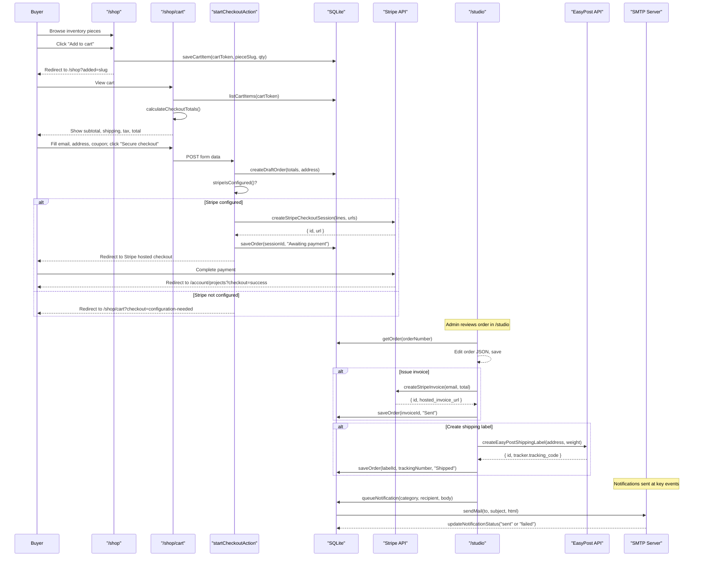

# Beaman Woodworks Payment and Shipment Integration

The payment and shipment system spans six layers: **database schema**, **site settings (seed configuration)**, **payment/shipping library**, **server actions**, **buyer-facing UI**, and **admin studio dashboard**. Here is how every piece connects, from the moment a buyer browses the shop to the moment a shipping label is created.

---

## 1. Foundation: Database Schema & Data Model

All commerce state lives in a local SQLite database managed by [site/lib/db.ts](site/lib/db.ts).
[site/lib/db.ts:264-265](site/lib/db.ts#L264-L265)

### `pieces` table — the product catalog

Each piece has `price_cents`, `inventory_count`, and `status`. Only pieces with `status = 'inventory'` appear on the shop page. Pieces with `priceCents: null` are commission-only (displayed as "By quote").
[site/lib/db.ts:350-373](site/lib/db.ts#L350-L373)

### `cart_items` table — the shopping cart

Cart rows are keyed by a `cart_token` (a UUID stored in an HTTP-only cookie) and optionally by `user_email` if the buyer is logged in. Each row links to a `piece_slug` with a `quantity` and optional `options_json`.
[site/lib/db.ts:466-475](site/lib/db.ts#L466-L475)

### `orders` table — the order record

This is the central commerce record. It stores every financial field and every external-service identifier:

| Column | Purpose |
|---|---|
| `order_number` | Primary key, generated as `BW-ORD-YYMMDD-XXXXX` |
| `subtotal_cents`, `shipping_cents`, `tax_cents`, `discount_cents`, `total_cents` | Itemized money breakdown |
| `currency`, `coupon_code`, `shipping_rate_label` | Pricing metadata |
| `shipping_address_json`, `billing_address_json` | Buyer addresses as JSON |
| `stripe_checkout_session_id` | Stripe hosted checkout session reference |
| `stripe_payment_intent_id` | Stripe payment intent (for post-checkout tracking) |
| `stripe_invoice_id` | Stripe invoice ID (for admin-issued invoices) |
| `shipping_label_id` | EasyPost shipment/label ID |
| `tracking_number` | Carrier tracking code from EasyPost |
| `invoice_status`, `payment_status`, `status` | Lifecycle state fields |

[site/lib/db.ts:477-501](site/lib/db.ts#L477-L501)

The `OrderRecord` TypeScript type mirrors this exactly:
[site/lib/db.ts:184-208](site/lib/db.ts#L184-L208)

### `notifications` table — email audit trail

Every transactional email (commission confirmation, project update, password reset) is first written here as a queue record with a `status` of `"queued"` or `"pending_configuration"`, then updated to `"sent"` or `"failed"` after delivery attempt.
[site/lib/db.ts:516-526](site/lib/db.ts#L516-L526)

---

## 2. Site Settings: Configurable Commerce Parameters

The seed file [site/lib/seed.ts](site/lib/seed.ts) defines the default commerce configuration inside `siteSettingsSeed`. These values are stored in the `settings` table and are editable from the studio dashboard at runtime.
[site/lib/seed.ts:83-162](site/lib/seed.ts#L83-L162)

Key commerce settings:

| Setting | Default | Purpose |
|---|---|---|
| `cartCurrency` | `"usd"` | Currency code passed to Stripe |
| `localTaxRate` | `0.0825` (8.25%) | Applied to (subtotal - discount + shipping) |
| `shippingBaseCents` | `9500` ($95.00) | Flat base shipping for any order |
| `shippingPerItemCents` | `2200` ($22.00) | Added per additional item beyond the first |
| `couponCodes` | `[{ code: "STUDIO10", percentOff: 10, active: true }]` | Percentage-off coupons validated at checkout |
| `checkout.provider` | `"stripe"` | Payment provider identifier |
| `checkout.automaticTax` | `true` | Enables Stripe Tax on the hosted session |
| `checkout.collectShippingAddress` | `true` | Asks for shipping address in Stripe Checkout |
| `checkout.allowPromotionCodes` | `true` | Enables Stripe-side promo codes |
| `checkout.successPath` | `"/account/projects"` | Redirect after successful payment |
| `checkout.cancelPath` | `"/shop"` | Redirect if buyer cancels |

[site/lib/seed.ts:113-128](site/lib/seed.ts#L113-L128)

---

## 3. Environment Variables: External Service Wiring

All external integrations are **opt-in** via environment variables. If they are absent, the system degrades gracefully rather than crashing.
[README.md:61-76](README.md?plain=1#L61-L76)

**Payment (Stripe):**
- `STRIPE_SECRET_KEY` — server-side API key for Stripe requests
- `STRIPE_PUBLISHABLE_KEY` — client-side key (checked for configuration status)

**Shipping (EasyPost):**
- `EASYPOST_API_KEY` — API key for EasyPost shipment creation
- `SHIP_FROM_NAME`, `SHIP_FROM_STREET1`, `SHIP_FROM_CITY`, `SHIP_FROM_STATE`, `SHIP_FROM_ZIP`, `SHIP_FROM_COUNTRY` — the studio's return/origin address

**Email (SMTP):**
- `SMTP_HOST`, `SMTP_PORT`, `SMTP_SECURE`, `SMTP_USER`, `SMTP_PASSWORD`

These are passed into the Docker container via [docker-compose.synology.yml](docker-compose.synology.yml):
[docker-compose.synology.yml:20-33](docker-compose.synology.yml#L20-L33)

---

## 4. The Payments Library: `site/lib/payments.ts`

This file contains all Stripe and EasyPost API integration logic. It exports pure functions with no side effects on the database — the calling server actions handle persistence.
[site/lib/payments.ts:1-7](site/lib/payments.ts#L1-L7)

### Configuration checks

Two guard functions determine whether external services are available:

```ts
export function stripeIsConfigured() {
  return Boolean(process.env.STRIPE_SECRET_KEY && process.env.STRIPE_PUBLISHABLE_KEY);
}

export function easyPostConfigured() {
  return Boolean(process.env.EASYPOST_API_KEY);
}
```
[site/lib/payments.ts:24-30](site/lib/payments.ts#L24-L30)

### Coupon resolution

`resolveCoupon()` takes the site's coupon list and a user-entered code, normalizes to uppercase, and returns the matching active coupon or `null`:
[site/lib/payments.ts:32-39](site/lib/payments.ts#L32-L39)

### Checkout totals calculation

`calculateCheckoutTotals()` is the single source of truth for all money math. It computes:

1. **Subtotal** = sum of (unit price × quantity) for all line items
2. **Shipping** = base rate + (per-item rate × (total quantity - 1)), or $0 if cart is empty
3. **Discount** = subtotal × coupon percentage (if a valid coupon is applied)
4. **Taxable amount** = (subtotal - discount) + shipping
5. **Tax** = taxable amount × tax rate
6. **Total** = subtotal + shipping + tax - discount

[site/lib/payments.ts:41-70](site/lib/payments.ts#L41-L70)

This function is called in two places: the cart page (for display) and the `startCheckoutAction` (for the actual order).

### Stripe API communication

A private `stripeRequest()` helper sends form-encoded POST requests to `https://api.stripe.com/v1/` using the `STRIPE_SECRET_KEY` as a Bearer token. It throws on non-OK responses with the Stripe error message.
[site/lib/payments.ts:80-101](site/lib/payments.ts#L80-L101)

### `createStripeCheckoutSession()`

Creates a Stripe **hosted Checkout Session** in `payment` mode. The session configuration includes:

- `customer_email` — pre-filled from the buyer's form input
- `success_url` / `cancel_url` — built from `SITE_URL` + configured paths, with `?order=...&checkout=success|cancelled` query params
- `metadata[order_number]` — links the Stripe session back to the local order
- `billing_address_collection: required`
- Optional `automatic_tax`, `allow_promotion_codes`, and `shipping_address_collection` (US + CA)
- Line items with inline `price_data` (name, description, unit amount in cents, quantity)

Returns `{ id, url }` — the session ID (stored on the order) and the hosted checkout URL (used for redirect).
[site/lib/payments.ts:103-148](site/lib/payments.ts#L103-L148)

### `createStripeInvoice()`

Used by the admin to issue invoices from the studio dashboard. It:

1. Creates a Stripe **Customer** by email
2. Creates an **InvoiceItem** on that customer with the order total and description
3. Creates an **Invoice** with `collection_method: send_invoice`, `days_until_due: 7`, and `auto_advance: true`

Returns `{ id, hosted_invoice_url }`.
[site/lib/payments.ts:150-173](site/lib/payments.ts#L150-L173)

### `createEasyPostShippingLabel()`

Creates an EasyPost **Shipment** with:

- **To address**: buyer's name, street, city, state, zip, country (from the order's `shippingAddress`)
- **From address**: the studio's address from `SHIP_FROM_*` env vars (defaults to "Beaman Woodworks" / "US")
- **Parcel**: weight in ounces (passed from the form, defaults to 96 oz / 6 lbs)

Authenticates via HTTP Basic Auth with the EasyPost API key. Returns the full shipment object, which includes a `tracker.tracking_code`.
[site/lib/payments.ts:175-226](site/lib/payments.ts#L175-L226)

---

## 5. The Notification System: `site/lib/notifications.ts`

Every transactional email flows through `sendNotificationEmail()`. This function:

1. **Always** writes a notification record to the database via `queueNotification()` — even if SMTP is not configured (status becomes `"pending_configuration"`)
2. Checks if SMTP is configured; if not, returns `{ queued: true, sent: false }`
3. If SMTP is configured, creates a Nodemailer transport and sends the email with:
   - `from`: the site's configured `email.fromName` / `email.fromAddress`
   - `to`: the specified recipient(s)
   - `bcc`: always includes `email.forwardTo` (the builder's Gmail) for a copy
   - `replyTo`: the site's configured reply address
4. Updates the notification status to `"sent"` or `"failed"` with any error message

[site/lib/notifications.ts:1-64](site/lib/notifications.ts#L1-L64)

---

## 6. Buyer-Facing Flow: Shop → Cart → Checkout

### Step 1: Browsing the Shop (`/shop`)

The shop page at [site/app/shop/page.tsx](site/app/shop/page.tsx) lists all pieces where `status === "inventory"`. Each piece card shows:
- Image (from verified media), title, category, inventory count
- Price (formatted via `formatMoney()`, which shows "By quote" for `null` prices)
- An **"Add to cart"** button that submits a form to `addToCartAction`

[site/app/shop/page.tsx:7-37](site/app/shop/page.tsx#L7-L37)

### Step 2: Adding to Cart

`addToCartAction` in [site/lib/actions.ts](site/lib/actions.ts):

1. Reads or creates a `beaman-cart` cookie (UUID, HTTP-only, 30-day expiry, secure in production)
2. Gets the current user session (if logged in)
3. Calls `saveCartItem()` which upserts into `cart_items` — if the same piece is already in the cart for that token, it updates the quantity

After saving, it redirects to `/shop?added=<slug>`.
[site/lib/actions.ts:77-93](site/lib/actions.ts#L77-L93), [site/lib/actions.ts:213-224](site/lib/actions.ts#L213-L224)

### Step 3: Reviewing the Cart (`/shop/cart`)

The cart page at [site/app/shop/cart/page.tsx](site/app/shop/cart/page.tsx):

1. Reads the cart cookie and current user
2. Fetches cart items via `listCartItems(cartToken, userEmail)`
3. Resolves each cart item to its piece record (skipping items with missing prices)
4. Calls `calculateCheckoutTotals()` to compute subtotal, shipping, tax, and total
5. Renders:
   - Each line item with image, title, subtitle, price, quantity, and a **Remove** button
   - A checkout summary panel showing subtotal, shipping, tax, and total
   - A checkout form with fields for: email, coupon code, shipping name, street, city, state, ZIP
   - A **"Secure checkout"** button

[site/app/shop/cart/page.tsx:9-92](site/app/shop/cart/page.tsx#L9-L92)

### Step 4: Starting Checkout (`startCheckoutAction`)

This is the critical server action that bridges the local system to Stripe. When the buyer clicks "Secure checkout":

1. **Reads cart state**: cart token, user session, site settings, buyer email from the form
2. **Builds line items**: maps each cart item to its piece, extracting slug, title, quantity, unit price, and description
3. **Calculates totals**: calls `calculateCheckoutTotals()` with the site's coupon list, shipping rates, and tax rate, plus the buyer's coupon code from the form
4. **Creates a draft order**: calls `createDraftOrder()` which:
   - Generates an order number like `BW-ORD-260328-A1B2C`
   - Inserts into the `orders` table with all financial fields, the shipping address from the form, and `status: "Draft"`
5. **Checks Stripe configuration**:
   - **If Stripe IS configured**: calls `createStripeCheckoutSession()`, then updates the order with the `stripeCheckoutSessionId` and sets `status: "Awaiting payment"`, then **redirects the buyer to the Stripe hosted checkout URL**
   - **If Stripe is NOT configured**: redirects to `/shop/cart?checkout=configuration-needed&order=<orderNumber>` — a graceful degradation that tells the buyer checkout isn't available yet

[site/lib/actions.ts:233-306](site/lib/actions.ts#L233-L306)

### Step 5: Stripe Hosted Checkout (external)

The buyer is now on Stripe's hosted page. Stripe handles:
- Card entry and payment processing
- Billing address collection (required)
- Shipping address collection (US + CA, if enabled)
- Automatic tax calculation (if enabled)
- Promotion code entry (if enabled)

On success, Stripe redirects to `{SITE_URL}/account/projects?order=<orderNumber>&checkout=success`.
On cancellation, Stripe redirects to `{SITE_URL}/shop?order=<orderNumber>&checkout=cancelled`.

[site/lib/payments.ts:115-119](site/lib/payments.ts#L115-L119)

---

## 7. Admin-Facing Flow: Studio Dashboard Order Management

After a buyer completes checkout, the order appears in the **Orders** section of the studio dashboard at `/studio`.
[site/app/studio/page.tsx:373-395](site/app/studio/page.tsx#L373-L395)

Each order card in the dashboard shows:
- The order number and total amount
- A JSON editor textarea pre-filled with the full order record (all fields editable)
- A **"Save order"** button to persist changes
- An **"Issue invoice"** button
- A **"Create label"** button

### Editing an Order (`saveOrderAction`)

The admin can edit any order field via the JSON editor — status, payment status, tracking number, addresses, etc. The action merges the JSON input with the existing order and persists it.
[site/lib/actions.ts:625-635](site/lib/actions.ts#L625-L635)

### Issuing a Stripe Invoice (`createInvoiceAction`)

When the admin clicks "Issue invoice":

1. Requires admin authentication
2. Loads the order by number
3. Calls `createStripeInvoice()` with the buyer's email, order number, currency, description, and total
4. Updates the order with `stripeInvoiceId` and sets `invoiceStatus: "Sent"`

This is useful for orders that need a formal invoice (e.g., commission deposits, custom quotes) rather than the standard checkout flow.
[site/lib/actions.ts:637-654](site/lib/actions.ts#L637-L654)

### Creating a Shipping Label (`createShippingLabelAction`)

When the admin clicks "Create label":

1. Requires admin authentication
2. Loads the order and its `shippingAddress`
3. Calls `createEasyPostShippingLabel()` with the buyer's address and a weight (default 96 oz from a hidden form field)
4. Updates the order with:
   - `shippingLabelId` — the EasyPost shipment ID
   - `trackingNumber` — extracted from `label.tracker.tracking_code`
   - `status: "Shipped"`

[site/lib/actions.ts:656-675](site/lib/actions.ts#L656-L675)

---

## 8. End-to-End Flow Diagram



---

## 9. Graceful Degradation

A critical design principle: every external service degrades honestly when not configured.
[AGENTS.md:42](AGENTS.md?plain=1#L42)

| Service | When Missing | Behavior |
|---|---|---|
| **Stripe** (`STRIPE_*`) | Checkout redirects to `?checkout=configuration-needed` instead of Stripe | Cart and totals still work; orders are created as drafts |
| **EasyPost** (`EASYPOST_API_KEY`) | "Create label" button throws an error | Order can still be manually updated with tracking info via JSON editor |
| **SMTP** (`SMTP_*`) | Notifications queue with status `"pending_configuration"` | All notification records are preserved in the DB for later review; no emails are sent |

[site/lib/notifications.ts:38-44](site/lib/notifications.ts#L38-L44), [site/lib/actions.ts:303-306](site/lib/actions.ts#L303-L306)

---

## 10. Troubleshooting Reference

The admin manual documents the three most common failure modes:
[admin.md:216-231](admin.md?plain=1#L216-L231)

- **Checkout did not open Stripe**: verify `STRIPE_SECRET_KEY`, `STRIPE_PUBLISHABLE_KEY`, `SITE_URL`, and `NEXT_PUBLIC_SITE_URL`
- **Shipping labels fail**: verify `EASYPOST_API_KEY`, all `SHIP_FROM_*` values, and that the order has valid shipping address fields
- **No email sent**: verify all `SMTP_*` values, then check the Notifications section in the studio dashboard for queued or failed records

---

## Summary of Key Files

| File | Role in Payment/Shipment |
|---|---|
| [site/lib/payments.ts](site/lib/payments.ts) | Stripe checkout sessions, Stripe invoices, EasyPost labels, coupon resolution, totals math |
| [site/lib/actions.ts](site/lib/actions.ts) | Server actions: `addToCartAction`, `startCheckoutAction`, `createInvoiceAction`, `createShippingLabelAction`, `saveOrderAction` |
| [site/lib/db.ts](site/lib/db.ts) | SQLite schema for `cart_items`, `orders`, `notifications`; CRUD functions for all commerce entities |
| [site/lib/notifications.ts](site/lib/notifications.ts) | SMTP transport, notification queue, send/fail tracking |
| [site/lib/seed.ts](site/lib/seed.ts) | Default commerce settings (tax rate, shipping rates, coupons, checkout config) |
| [site/app/shop/page.tsx](site/app/shop/page.tsx) | Public shop listing with "Add to cart" buttons |
| [site/app/shop/cart/page.tsx](site/app/shop/cart/page.tsx) | Cart display, totals summary, checkout form |
| [site/app/studio/page.tsx](site/app/studio/page.tsx) | Admin order management: JSON editor, "Issue invoice" and "Create label" buttons |
| [docker-compose.synology.yml](docker-compose.synology.yml) | Passes all `STRIPE_*`, `EASYPOST_*`, `SMTP_*`, and `SHIP_FROM_*` env vars into the container |
| [README.md](README.md?plain=1) | Documents required environment variables for live services |
| [AGENTS.md](AGENTS.md?plain=1) | Documents graceful degradation design principle |
| [admin.md](admin.md?plain=1) | Troubleshooting guide for checkout, shipping, and email failures |
