# Woodsmith — DeepWiki (Merged Export)

> Exported from the DeepWiki for `lowestprime/woodsmith` on 2026-03-22.

---

## Table of Contents

1. [Woodsmith — Project Overview](#1-woodsmith--project-overview)
  [1.1 Getting Started & Local Development](#11-getting-started--local-development)
  [1.2 Self-Hosted Deployment (Docker & Synology)](#12-self-hosted-deployment-docker--synology)
2. [Application Architecture](#2-application-architecture)
  [2.1 Content Model & Static Data](#21-content-model--static-data)
  [2.2 Database Layer (SQLite)](#22-database-layer-sqlite)
  [2.3 Server Actions](#23-server-actions)
  [2.4 Authentication (Studio Session)](#24-authentication-studio-session)
3. [Public-Facing Pages](#3-public-facing-pages)
  [3.1 Portfolio & Piece Detail Pages](#31-portfolio--piece-detail-pages)
  [3.2 Shop (Inventory Reservation)](#32-shop-inventory-reservation)
  [3.3 Journal](#33-journal)
  [3.4 Commissions & Buyer Request Dossier](#34-commissions--buyer-request-dossier)
4. [Studio Dashboard (Admin Interface)](#4-studio-dashboard-admin-interface)
  [4.1 Studio Login & Session Management](#41-studio-login--session-management)
  [4.2 Request Management (Studio Controls)](#42-request-management-studio-controls)
5. [UI Components & Styling](#5-ui-components--styling)
  [5.1 Site Chrome Components](#51-site-chrome-components)
  [5.2 Form Components](#52-form-components)
  [5.3 Design System & Global CSS](#53-design-system--global-css)
6. [Media Serving & Photo Library](#6-media-serving--photo-library)
7. [Typography Assets — ITC New Rennie Mackintosh](#7-typography-assets--itc-new-rennie-mackintosh)
8. [Glossary](#8-glossary)

---

# 1. Woodsmith — Project Overview

<details>
<summary>Relevant source files</summary>

The following files were used as context for generating this wiki page:

- docker-compose.synology.yml
- package.json
- site/app/layout.tsx
- site/app/page.tsx
- site/package.json

</details>

Woodsmith is a self-hosted woodworking portfolio, journal, and commission management system designed for individual makers and small studios. It combines a high-fidelity aesthetic inspired by Japanese minimalism and Mackintosh design with a functional back-office for tracking customer requests.

The project is specifically architected for deployment on **Synology NAS** hardware using Docker, providing a private alternative to third-party commerce and portfolio platforms.

## System Capabilities

Woodsmith serves three primary user groups through a unified Next.js application:

1.  **Public Visitors:** Can browse a high-resolution portfolio, read process-heavy journal entries, and view available inventory.
2.  **Potential Buyers:** Can submit commission briefs or purchase requests and track their specific project through a private "Buyer Dossier" using a unique reference number.
3.  **Studio Admin:** A password-protected dashboard for managing the lifecycle of requests, posting build updates, and maintaining internal project notes.

## Technology Stack

The application is built with a modern, lightweight stack focused on performance and ease of self-hosting:

| Layer | Technology | Purpose |
| :--- | :--- | :--- |
| **Framework** | Next.js 16 (App Router) | React-based server-side rendering and routing. |
| **Database** | Node.js `sqlite` (Experimental) | Built-in SQLite support for persistence without external DB containers. |
| **Styling** | Standard CSS / CSS Variables | High-performance, zero-runtime styling with a custom design system. |
| **Typography** | ITC New Rennie Mackintosh | Local OTF font assets for a distinct studio identity. |
| **Deployment** | Docker & Docker Compose | Containerized environment optimized for Synology NAS. |

## System Architecture

The following diagram illustrates how the various components of Woodsmith interact, bridging the gap between the user-facing features and the underlying code entities.

### Logic & Data Flow

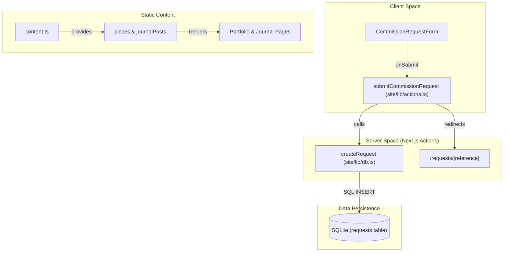

### Deployment & Environment

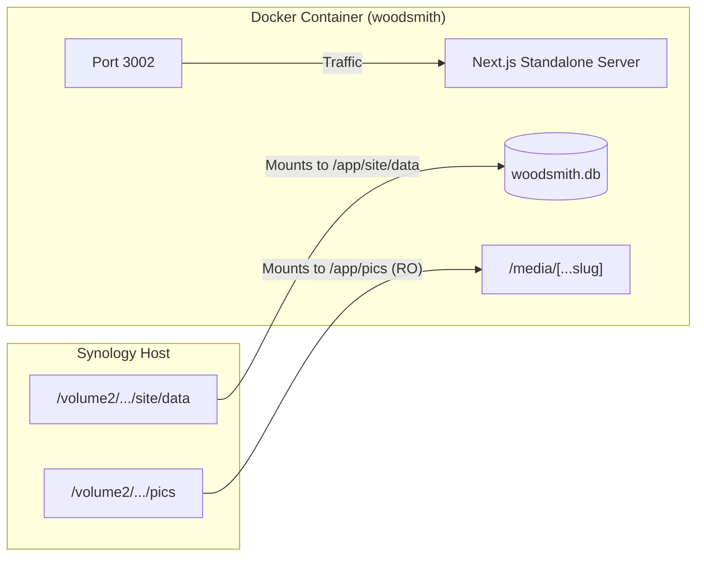

## Navigation & Subsystems

The codebase is organized into several key subsystems that handle different aspects of the studio's operations:

*   **Getting Started & Local Development:** Covers the monorepo structure, installation of dependencies, and the `npm run dev` workflow which utilizes the experimental Node.js SQLite driver.
*   **Self-Hosted Deployment (Docker & Synology):** Details the production build process, environment variables like `STUDIO_PASSWORD`, and how to map Synology volumes for persistent storage.
*   **Application Architecture:** Explores the Next.js App Router, including the `RootLayout` and the integration of the custom Mackintosh font.
*   **Content & Media:** Explains how static content (pieces, posts) is defined in code while high-resolution images are served via a dedicated media API.
*   **Studio Dashboard:** Describes the administrative interface for managing the request lifecycle and project updates.

---

# 1.1 Getting Started & Local Development

<details>
<summary>Relevant source files</summary>

The following files were used as context for generating this wiki page:

- .codex/environments/environment.toml
- .gitignore
- package.json
- site/eslint.config.mjs
- site/next.config.ts
- site/package.json
- site/tsconfig.json

</details>

This page provides the technical specifications for setting up the Woodsmith development environment. It covers the monorepo structure, dependency management, and the specific Node.js configuration required to support the integrated SQLite database.

## Monorepo Layout

Woodsmith is organized as a monorepo with a root workspace and a primary application directory. The structure separates project-wide configuration from the Next.js application logic.

| Directory / File | Description |
|:---|:---|
| `site/` | The core Next.js application, including components, server actions, and styles. |
| `pics/` | The source image library for portfolio and shop items. |
| `data/` | Local SQLite database storage (ignored by git). |
| `package.json` | Root workspace file providing proxy scripts for the sub-project. |
| `.codex/` | Environment configuration for the Codex development tool. |

### Project Structure Diagram

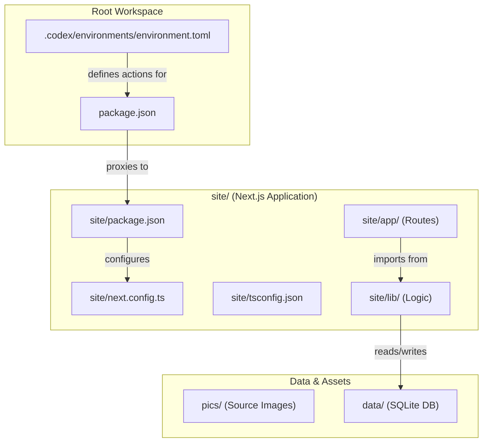

## Installation & Setup

### Prerequisites
- **Node.js**: Woodsmith requires a modern version of Node.js (v22+ recommended) because it utilizes the built-in `node:sqlite` module (DatabaseSync).
- **NPM**: Standard package manager for dependency resolution.

### Step 1: Clone and Install
Clone the repository and install dependencies from the root directory:

```bash
git clone <repository-url>
cd woodsmith
npm install
```

### Step 2: Environment Variables
The application requires several environment variables for security and authentication. Create a `.env` file in the `site/` directory.

| Variable | Purpose |
|:---|:---|
| `SESSION_SECRET` | HMAC signing key for studio session cookies. |
| `STUDIO_PASSWORD` | The password required to access the `/studio` dashboard. |
| `DATA_PATH` | (Optional) Custom path for the SQLite database file. |

## Development Scripts

The project uses root-level scripts to manage the `site/` application. These are defined in the root `package.json` and utilize the `--prefix` flag to target the application directory.

### Command Execution Flow

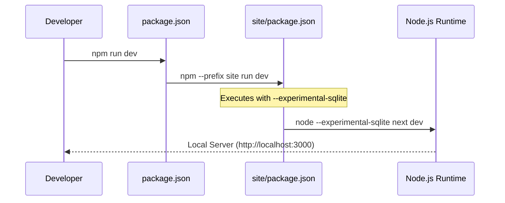

### Primary Commands
- **Start Development Server**: `npm run dev`
  - Runs `next dev` with the `--experimental-sqlite` flag enabled.
- **Type Checking**: `npm run typecheck`
  - Runs `tsc --noEmit` within the `site/` directory.
- **Linting**: `npm run lint`
  - Executes ESLint on `app`, `components`, and `lib` directories.
- **Production Build**: `npm run build`
  - Generates a standalone production build.

## Codex Environment Configuration

The project includes a Codex environment definition that maps common development tasks to a standardized UI or CLI toolset.

### Defined Actions
The Codex configuration automates the following workflows:
1. **dev**: Executes `npm run dev`.
2. **typecheck**: Executes `npm run typecheck`.
3. **lint**: Executes `npm run lint`.
4. **test**: Executes `npm run test`.
5. **build**: Executes `npm run build`.
6. **sync**: Executes `git pull --rebase` to keep the local environment up to date.

## Technical Implementation Details

### SQLite Integration
Unlike typical Next.js projects using external ORMs, Woodsmith uses the native Node.js SQLite implementation. This requires the `--experimental-sqlite` flag to be passed to the Node process in all scripts (dev, build, and start).

### Build Output
The application is configured for `standalone` output. This mode is optimized for Docker deployments, as it bundles only the necessary `node_modules` into the `.next/standalone` directory.

### Linting and Typescript
- **ESLint**: Uses `next/core-web-vitals` and ignores the `.next`, `node_modules`, and `data` directories.
- **TypeScript**: Configured with `strict` mode enabled and `ES2022` as the target. It uses `bundler` module resolution to match Next.js requirements.

---

# 1.2 Self-Hosted Deployment (Docker & Synology)

<details>
<summary>Relevant source files</summary>

The following files were used as context for generating this wiki page:

- .dockerignore
- Dockerfile
- docker-compose.synology.yml

</details>

This page details the containerization and deployment strategy for Woodsmith. The application is designed to be self-hosted using Docker, with specific configurations provided for Synology NAS environments using persistent volume mounts for the SQLite database and the high-resolution image library.

## Container Architecture

Woodsmith utilizes a multi-stage `Dockerfile` to optimize image size and security. The build process separates the build-time dependencies and compilation steps from the lightweight runtime environment.

### Build Stages

1.  **Builder Stage**: Uses `node:22-bookworm-slim` to install dependencies via `npm ci` and executes `npm run build`. This stage generates the Next.js standalone output.
2.  **Runner Stage**: A hardened production image that creates a non-privileged `nextjs` user and group (UID/GID 1001). It copies only the necessary standalone server files, static assets, and the initial data directory.

### Runtime Configuration

The container executes the standalone server using Node.js with the `--experimental-sqlite` flag enabled to support the `node:sqlite` module.

| Variable | Default | Description |
| :--- | :--- | :--- |
| `PORT` | `3002` | Internal container port. |
| `HOSTNAME` | `0.0.0.0` | Bind address for the Next.js server. |
| `NODE_ENV` | `production` | Enables production optimizations. |

## Deployment Flow & Data Mapping

The deployment relies on mapping host directories to container paths to ensure data persistence for the SQLite database and access to the external `pics/` library.

### System Integration Diagram

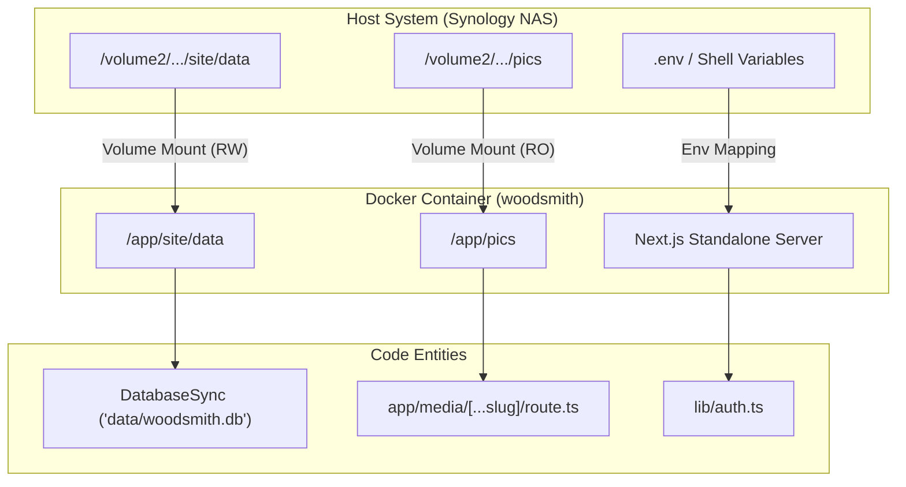

## Synology Configuration (`docker-compose.synology.yml`)

The `docker-compose.synology.yml` file is tailored for deployment on Synology NAS devices, typically behind a reverse proxy (like Synology's built-in Nginx).

### Volume Mounts
Two critical volumes must be defined to maintain state:
1.  **Data Volume**: Maps the host's data directory to `/app/site/data`. This persists the `woodsmith.db` SQLite file.
2.  **Pics Volume**: Maps the host's image library to `/app/pics` in **read-only** mode (`ro`). This allows the application to serve portfolio and shop images without modifying the source files.

### Security & Environment
The compose file provides placeholders for sensitive credentials:
*   `STUDIO_PASSWORD`: The password for `/studio` dashboard access.
*   `SESSION_SECRET`: The HMAC key used by `lib/auth.ts` to sign session cookies.
*   `SELF_HOSTED`: Set to `"true"` to signal the application environment.

## Build Context & Exclusions

The `.dockerignore` file ensures that the build context sent to the Docker daemon is minimal, preventing local development artifacts from bloating the image or leaking secrets.

### Excluded Assets
*   **Local Node Modules**: Both root and `site/` `node_modules` are ignored.
*   **Build Artifacts**: `.next`, `.output`, and `.sst` directories are excluded.
*   **Secrets**: All `.env` and `.env.local` files are ignored to ensure production secrets are only injected via the container orchestrator.
*   **Synology Metadata**: Specific Synology filesystem artifacts like `@eaDir` and `#recycle` are ignored.

## Service Execution Logic

When the container starts, it initiates the `server.js` file produced by the Next.js standalone build.

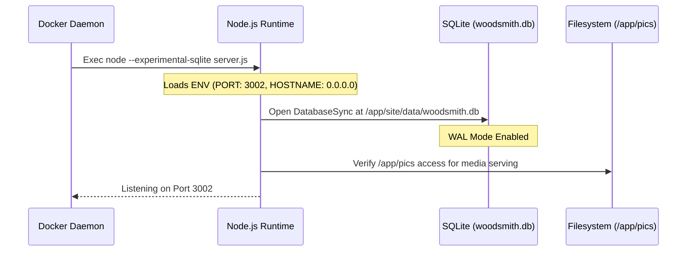

---

# 2. Application Architecture

<details>
<summary>Relevant source files</summary>

The following files were used as context for generating this wiki page:

- site/app/globals.css
- site/app/layout.tsx
- site/next-env.d.ts
- site/next.config.ts

</details>

This page provides a high-level overview of the Woodsmith application structure. Woodsmith is built using **Next.js** and leverages the **App Router** for its layout system, **Server Actions** for data mutations, and a local **SQLite** database for persistence.

The application is designed as a "hybrid" system: the portfolio, shop, and journal content are defined as static TypeScript objects (the "Content Model"), while customer inquiries, purchase requests, and status updates are stored dynamically in the database.

## Page Hierarchy & Routing

Woodsmith uses the Next.js App Router. The layout is defined centrally in `site/app/layout.tsx`, which wraps all pages in a global `Shell` containing the `SiteHeader` and `SiteFooter`.

### System Navigation Map

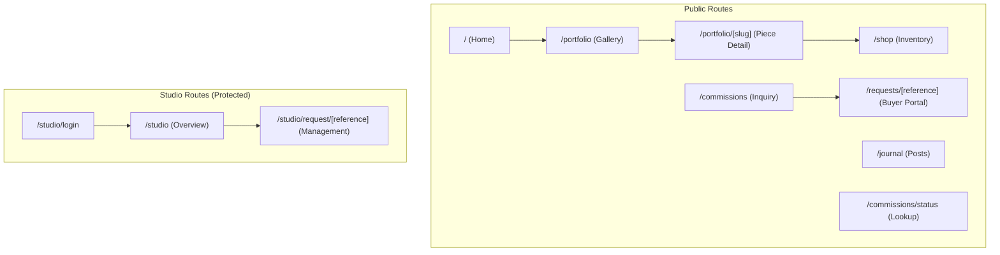

## Data Flow: Content vs. Database

Woodsmith distinguishes between **Content** (authored in code) and **Requests** (authored by users/admin).

1.  **Static Content**: Pieces, Journal Posts, and Studio Values are defined in `site/lib/content.ts`. These are used to generate the portfolio and shop pages.
2.  **Dynamic Data**: When a user submits a form (e.g., `CommissionRequestForm`), a **Server Action** validates the input and writes a record to the SQLite database via `site/lib/db.ts`.

### Bridging Content to Code Entities

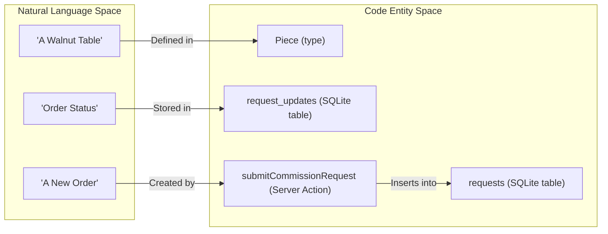

## Core Subsystems

### Content Model & Static Data
All non-transactional data is hardcoded in TypeScript. This includes the `pieces` array which drives the portfolio and the `journalPosts` array.
*   **Key File**: `site/lib/content.ts`

### Database Layer (SQLite)
The application uses the Node.js built-in `DatabaseSync` to manage a local `woodsmith.db` file. It handles "requests" (commissions/purchases) and "updates" (timeline events).
*   **Key File**: `site/lib/db.ts`

### Server Actions
Next.js Server Actions handle all form submissions. They act as the "Controller" layer, bridging the UI forms in `site/components/forms.tsx` to the database logic in `site/lib/db.ts`.
*   **Key File**: `site/lib/actions.ts`

### Authentication
The "Studio" (admin) area is protected by a session-based authentication system using HMAC-signed cookies. It does not require a complex identity provider, relying instead on an environment variable (`STUDIO_PASSWORD`).
*   **Key File**: `site/lib/auth.ts`

## Request Lifecycle Diagram

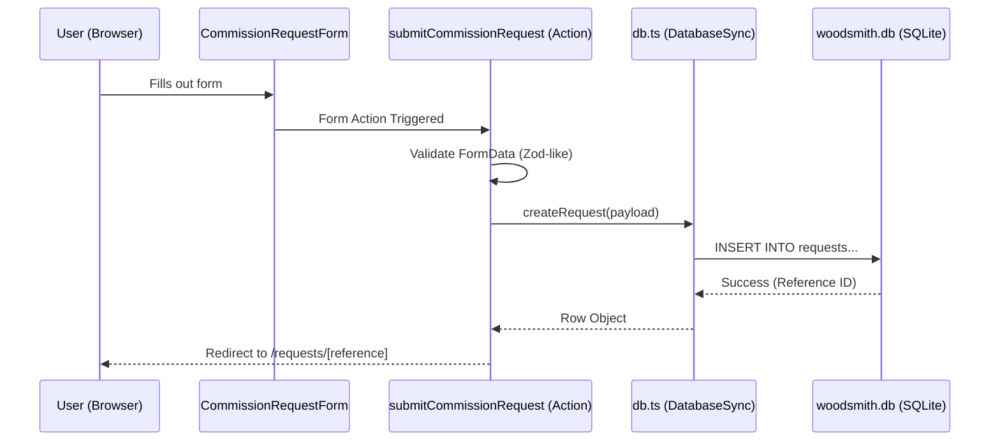

## Shared UI & Styling
The visual identity is defined in `site/app/globals.css` using CSS Custom Properties for colors (e.g., `--cedar`, `--moss`, `--lacquer`). Components are split between `site-chrome.tsx` (layout/display) and `forms.tsx` (interactive elements).
*   **Fonts**: Custom "Mackintosh" font family loaded via `next/font/local` in the root layout.
*   **Styling**: Primarily standard CSS classes with a focus on a "grid" and "shell" layout system.

---

# 2.1 Content Model & Static Data

<details>
<summary>Relevant source files</summary>

The following files were used as context for generating this wiki page:

- site/lib/content.ts
- site/lib/format.ts

</details>

This page provides a technical deep dive into the static content architecture of Woodsmith. Unlike traditional CMS-driven applications, Woodsmith treats its portfolio and journal as "code-as-content," using TypeScript types and hardcoded arrays to manage site data. This approach ensures type safety, high performance, and simplified deployment without requiring an external database for the primary content library.

## Data Types and Enums

The core of the content model is defined in `site/lib/content.ts`. It utilizes TypeScript interfaces to enforce a strict schema for furniture pieces and journal entries.

### Piece Status
The `PieceStatus` enum determines the business logic applied to a furniture item, including which UI components are rendered (e.g., a purchase form vs. a commission inquiry form).

| Status | Description |
| :--- | :--- |
| `inventory` | Items currently built and available for immediate reservation/purchase. |
| `commission` | Patterns or previous works that can be recreated or adapted upon request. |
| `archive` | Historical works shown for portfolio purposes but not currently open for orders. |

### The Piece Type
The `Piece` type represents a single work of furniture or cabinetry. It contains metadata for categorization, storytelling, and logistics.

| Field | Type | Description |
| :--- | :--- | :--- |
| `slug` | `string` | Unique identifier used in URLs (e.g., `/portfolio/hallway-bench`). |
| `name` | `string` | Display name of the piece. |
| `category` | `string` | Grouping (e.g., "Seating", "Cabinetry"). |
| `status` | `PieceStatus` | The availability state of the piece. |
| `yearLabel` | `string` | Text displayed near the title (e.g., "Archive study"). |
| `summary` | `string` | Brief one-sentence description for cards. |
| `story` | `string` | Longer narrative text for the detail page. |
| `images` | `string[]` | Array of asset paths (relative to the `pics/` directory). |
| `notes` | `string[]` | Bulleted technical or usage details. |

### The JournalPost Type
Journal entries are simpler structures used for the "Journal" section of the site, supporting Markdown-ready body content.

| Field | Type | Description |
| :--- | :--- | :--- |
| `slug` | `string` | URL identifier (e.g., `/journal/on-restraint`). |
| `title` | `string` | Post headline. |
| `date` | `string` | ISO date string for sorting and formatting. |
| `body` | `string` | The full content of the post. |

## Static Data Definition

Content is authored directly in `site/lib/content.ts` within two primary exported arrays: `pieces` and `journalPosts`.

### Media Referencing
To simplify image paths, a private `media` helper function is used to concatenate directory names (like `Furniture` or `Cabinets`) with filenames.
*   **Definition:** `const media = (folder: string, file: string) => \`${folder}/${file}\`;`
*   **Usage:** These paths are later processed by `toMediaUrl` in `site/lib/format.ts` to generate valid `/media/...` routes.

### Hardcoded Collections
The application exports several arrays used for populating navigation, filters, and form dropdowns:
*   `pieces`: The master list of all `Piece` objects.
*   `journalPosts`: The master list of all `JournalPost` objects.
*   `pieceNames`: A flat array of strings used for simple selection lists.

## Content Consumption & Helpers

Data flows from the static arrays into the Next.js App Router via helper functions. These functions provide a clean API for pages to retrieve specific records.

### Helper Functions
*   `getPiece(slug: string)`: Searches the `pieces` array for a matching slug.
*   `getPost(slug: string)`: Searches the `journalPosts` array for a matching slug.

### Content Resolution Diagram

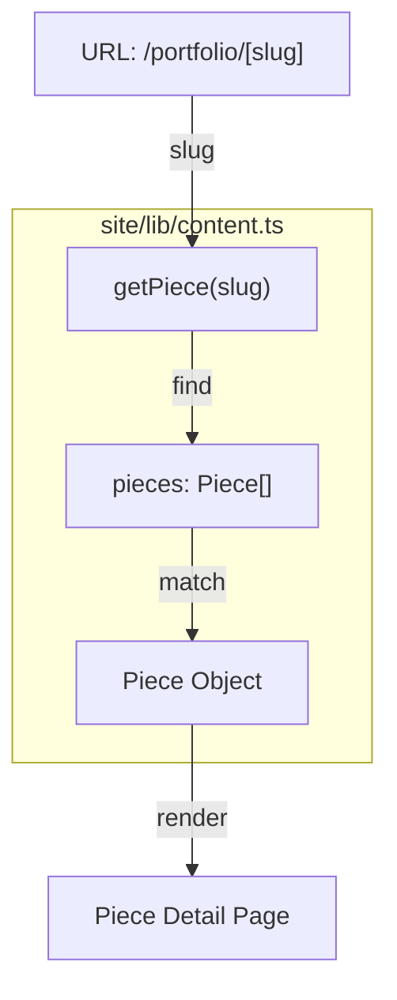

### Piece Status Logic Flow

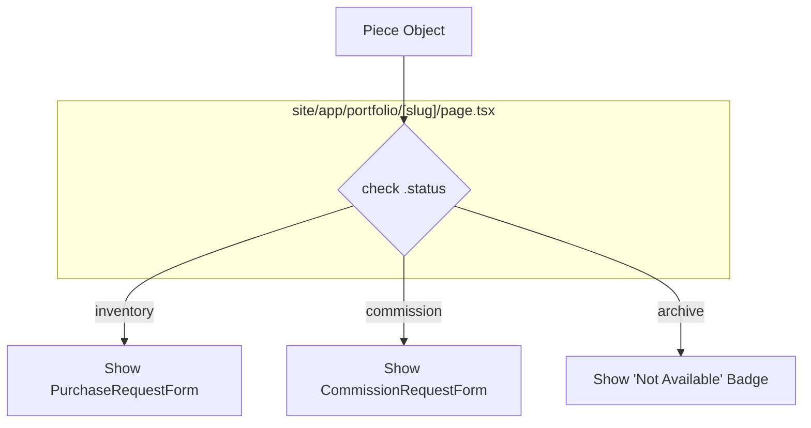

## Commission & Studio Metadata

In addition to furniture and posts, `content.ts` defines configuration for the commission intake process and studio branding.

### Commission Options
The `commissionOptions` object defines the available choices in the `CommissionRequestForm`. This ensures that the frontend dropdowns stay in sync with the expected data model.
*   `timbers`: List of wood species (e.g., "White Oak", "Walnut").
*   `finishes`: Available surface treatments (e.g., "Hand-rubbed Oil").

### Studio Values
The `studioValues` object contains global site metadata used in headers, footers, and the contact page.
*   `location`: "Central Coast, NSW"
*   `contactEmail`: The primary address for inquiries.

## Data Transformation for UI

Before being displayed, raw data from `content.ts` often passes through `site/lib/format.ts`. This utility library ensures consistent presentation across the site.

| Function | Input | Output | Purpose |
| :--- | :--- | :--- | :--- |
| `formatDate` | `"2024-03-20"` | `"March 20, 2024"` | Formats ISO strings for Journal posts. |
| `toMediaUrl` | `"Furniture/img.jpg"` | `"/media/Furniture/img.jpg"` | Encodes paths for the custom media server. |
| `sentenceCase` | `"inventory"` | `"Inventory"` | Standardizes casing for status badges. |

---

# 2.2 Database Layer (SQLite)

<details>
<summary>Relevant source files</summary>

The following files were used as context for generating this wiki page:

- site/data/.gitkeep
- site/lib/db.ts

</details>

The Woodsmith database layer provides a persistent storage solution for commission requests, purchase inquiries, and communication timelines. It is implemented using the Node.js built-in `DatabaseSync` module, which offers a synchronous API for SQLite operations.

## Database Initialization and Configuration

The database is initialized lazily via the `getDatabase` function. It ensures the storage directory exists and configures the SQLite environment for reliability and performance.

| Feature | Implementation Detail |
| :--- | :--- |
| **Storage Location** | `data/woodsmith.sqlite` relative to the process working directory. |
| **Journal Mode** | **WAL (Write-Ahead Logging)** is enabled to allow concurrent reads and writes. |
| **Constraints** | Foreign keys are enforced (`PRAGMA foreign_keys = ON`) and tables use `STRICT` mode for type safety. |

### Schema Definition

The system utilizes two primary tables:

1.  **`requests`**: Stores the core details of a commission or purchase, including customer contact info, piece details, and current status.
2.  **`request_updates`**: A ledger of events and messages associated with a request. It supports both public (buyer-visible) and private (studio-only) visibility.

**Data Flow: Entity Relationships**
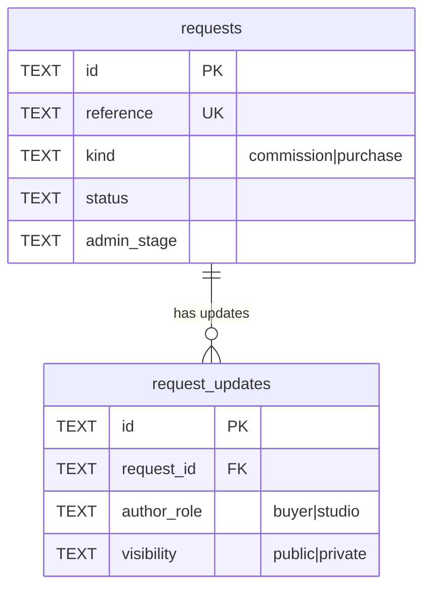

## Reference Number Generation

Every request is assigned a human-readable reference number via `createReference`. This reference serves as the primary lookup key for buyers in the "Dossier" view.

*   **Format**: `WS-[PREFIX]-[YYMMDD]-[RAND]`
*   **Prefixes**: `CM` for commissions, `SH` for shop purchases.
*   **Randomness**: A 4-character hex string derived from `randomUUID`.

## CRUD Operations

The database layer exports high-level functions to manage the lifecycle of a request.

### Creating Requests
The `createRequest` function performs an atomic transaction (`BEGIN IMMEDIATE`) to:
1.  Insert a new record into the `requests` table.
2.  Insert the initial message as the first entry in the `request_updates` table.

### Reading Data
The layer includes several lookup helpers that map raw SQLite rows to TypeScript types using `mapRequestRow` and `mapUpdateRow`.

*   **`listRequests()`**: Returns all requests ordered by the most recent update.
*   **`getRequestByReference(ref)`**: Retrieves a single request and its full update history.
*   **`findRequestForLookup(ref, email)`**: Validates a buyer's credentials for the public status page.
*   **`getDashboardSummary()`**: Calculates aggregate statistics (e.g., "Active Commissions", "New Requests") for the Studio Dashboard.

### Updating Data
*   **`updateRequest(ref, updates)`**: Updates administrative fields like `status`, `adminStage`, and `internalNotes`.
*   **`appendRequestUpdate(ref, update)`**: Adds a new message to the timeline.

**Code Mapping: API to Logic**
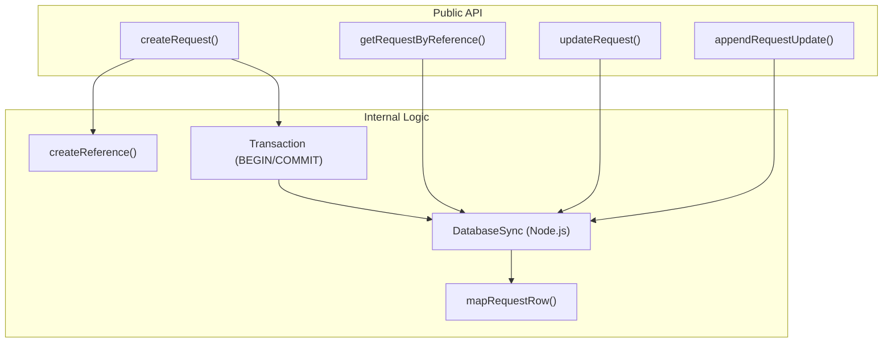

## Row Mapping and Types

To ensure type safety, the module defines `RequestRecord` and `RequestUpdateRecord`. Because SQLite returns rows as objects with snake_case keys (or as specified in the query), `mapRequestRow` converts these into camelCase TypeScript objects.

| Database Column | Record Property | Note |
| :--- | :--- | :--- |
| `piece_slug` | `pieceSlug` | Nullable for custom commissions. |
| `admin_stage` | `adminStage` | Studio-only workflow tracking. |
| `public_notes` | `publicNotes` | Shared notes visible to buyer. |
| `internal_notes` | `internalNotes` | Private studio-only notes. |

---

# 2.3 Server Actions

<details>
<summary>Relevant source files</summary>

The following files were used as context for generating this wiki page:

- site/lib/actions.ts

</details>

Server Actions in Woodsmith facilitate the bridge between the frontend forms and the SQLite database. Defined in `site/lib/actions.ts`, these functions handle data mutation, session management, and cache revalidation using Next.js "use server" directives.

## Overview of Action Flow

Every action follows a standard pattern: extracting data from `FormData`, validating fields, performing database operations, and finally triggering a redirect or path revalidation.

### Data Validation Helpers
The module provides two internal utility functions to handle `FormDataEntryValue` processing:
*   `requiredField(value, label)`: Trims whitespace and throws an Error if the field is missing or empty.
*   `optionalField(value)`: Trims whitespace and returns an empty string if the field is null or empty.

### Request Submission Logic
The following diagram illustrates the data flow from a public form to the database.

**Form Submission to Database Flow**
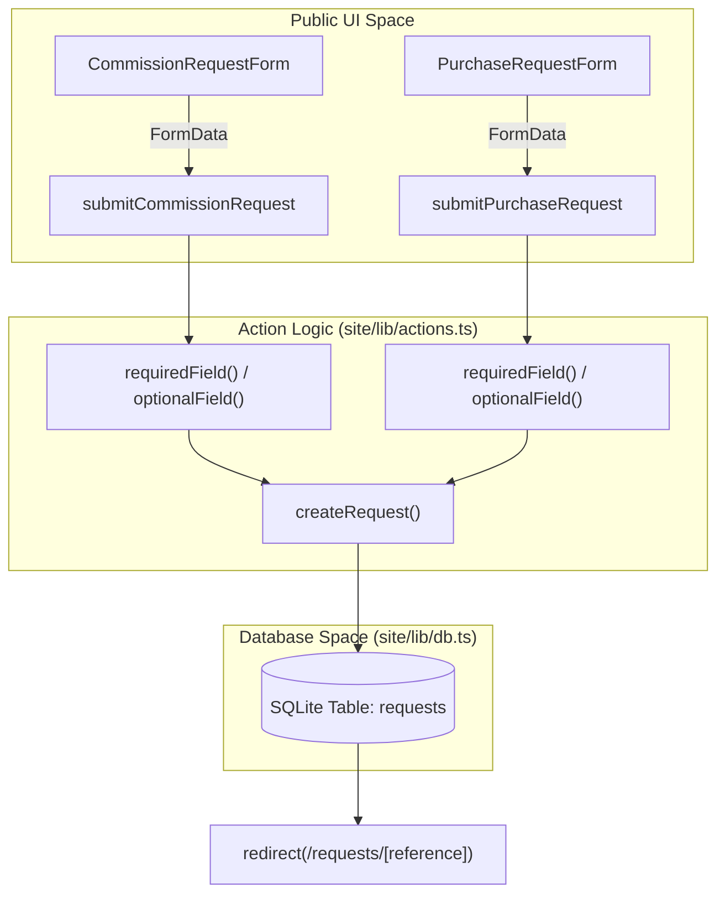

---

## Public Actions

These actions are accessible to site visitors and do not require an active studio session.

### `submitCommissionRequest`
Handles the intake for custom furniture commissions. It creates a new record in the `requests` table with a `kind` of `"commission"`.
*   **Initial Status:** "Brief received".
*   **Initial Stage:** "Reviewing brief".
*   **Redirect:** Sends the user to the unique dossier page for that reference.

### `submitPurchaseRequest`
Handles inventory reservations for existing pieces. It creates a record with a `kind` of `"purchase"`.
*   **Initial Status:** "Inventory inquiry received".
*   **Initial Stage:** "Confirming availability".

### `submitBuyerUpdate`
Allows a customer to post a message to their existing request timeline.
1.  Verifies the request exists using `findRequestForLookup(reference, email)` to ensure the user has the correct credentials.
2.  Appends a new record to the `request_updates` table via `appendRequestUpdate`.
3.  Calls `revalidatePath` to ensure the public dossier reflects the new message immediately.

---

## Studio Actions

Studio actions manage administrative tasks and require authentication.

### Authentication Actions
*   **`loginStudioAction`**: Validates the provided password against `verifyStudioPassword`. On success, it calls `createStudioSession` to set an HMAC-signed cookie and redirects to the dashboard.
*   **`logoutStudioAction`**: Calls `clearStudioSession` and redirects the user to the homepage.

### `updateStudioRequestAction`
This is the primary management action for the admin dashboard. It performs a multi-step update:
1.  **Authorization Check:** Calls `requireStudioSession()` to ensure the user is logged in.
2.  **Request Update:** Updates core fields (status, stage, notes) using `updateRequest`.
3.  **Timeline Update:** If a `studioMessage` is provided, it appends a new timeline entry. The visibility (public/private) is determined by the `messageVisibility` field.
4.  **Cache Invalidation:** Revalidates the dashboard, the specific studio request page, and the public-facing dossier page to ensure data consistency.

**Studio Management Data Flow**
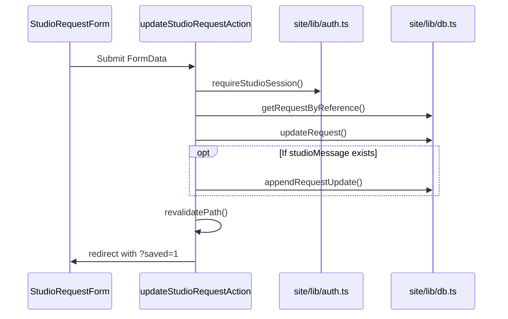

---

## Action Summary Table

| Function | File | Kind | Redirect Destination |
| :--- | :--- | :--- | :--- |
| `submitCommissionRequest` | `site/lib/actions.ts` | Public | `/requests/[reference]?created=1` |
| `submitPurchaseRequest` | `site/lib/actions.ts` | Public | `/requests/[reference]?created=1` |
| `submitBuyerUpdate` | `site/lib/actions.ts` | Public | `/requests/[reference]?updated=1` |
| `loginStudioAction` | `site/lib/actions.ts` | Auth | `/studio` |
| `logoutStudioAction` | `site/lib/actions.ts` | Auth | `/` |
| `updateStudioRequestAction` | `site/lib/actions.ts` | Studio | `/studio/request/[reference]?saved=1` |

---

# 2.4 Authentication (Studio Session)

<details>
<summary>Relevant source files</summary>

The following files were used as context for generating this wiki page:

- site/app/studio/login/page.tsx
- site/lib/auth.ts

</details>

The Woodsmith Studio dashboard is protected by a custom, lightweight authentication system that utilizes HMAC-signed cookies. This system avoids the overhead of a full identity provider or database-backed session store, instead relying on environment variables and cryptographic signatures to validate access to administrative routes.

## Core Security Mechanisms

Authentication is built upon two primary environment variables:
1.  `STUDIO_PASSWORD`: The plaintext password required to log in.
2.  `SESSION_SECRET`: The key used to generate HMAC signatures for session cookies.

The system employs `timingSafeEqual` from the Node.js `crypto` module to prevent timing attacks during password verification and signature validation.

### Session Token Structure
A session token is a string composed of two parts separated by a dot: `{payload}.{signature}`.
*   **Payload**: A Unix timestamp (in milliseconds) representing the session expiration.
*   **Signature**: An HMAC-SHA256 hash of the payload, keyed by the `SESSION_SECRET`.

### Logic Flow: Studio Session Lifecycle

The following diagram illustrates the transition from a login attempt to a verified session state.

**Studio Authentication Flow**
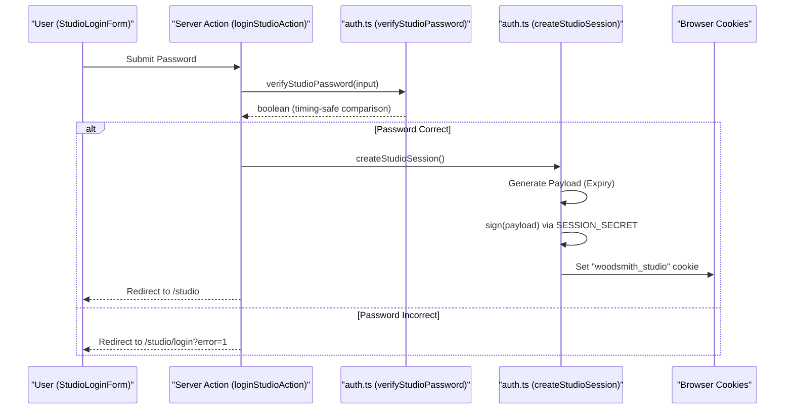

## Implementation Details

### Session Management Functions
The `site/lib/auth.ts` file exports several utility functions to manage the `woodsmith_studio` cookie.

| Function | Purpose | Implementation Detail |
| :--- | :--- | :--- |
| `verifyStudioPassword` | Validates a raw string against the `STUDIO_PASSWORD` env var. | Uses `safeEquals` for timing-attack resistance. |
| `createStudioSession` | Generates a signed token and sets a 7-day cookie. | Cookie is `httpOnly`, `sameSite: "lax"`, and `secure` in production. |
| `hasStudioSession` | Checks for a valid, unexpired, and correctly signed cookie. | Splits token and verifies HMAC signature against payload. |
| `requireStudioSession` | Middleware-like helper for protected routes. | Calls `redirect("/studio/login")` if session is invalid. |
| `clearStudioSession` | Deletes the session cookie. | Used during logout. |

### Security Constants & Fallbacks
The system includes built-in fallbacks to ensure functionality in local development, though these trigger warnings in the UI.

*   **Default Password**: `woodsmith-studio`.
*   **Fallback Secret**: `woodsmith-session-secret`.
*   **Cookie Name**: `woodsmith_studio`.

## Data Flow: Route Protection

The `requireStudioSession` function is the primary gatekeeper for the `/studio` directory. It is typically called at the top of Server Components within the studio sub-hierarchy.

**Verification Logic Space**
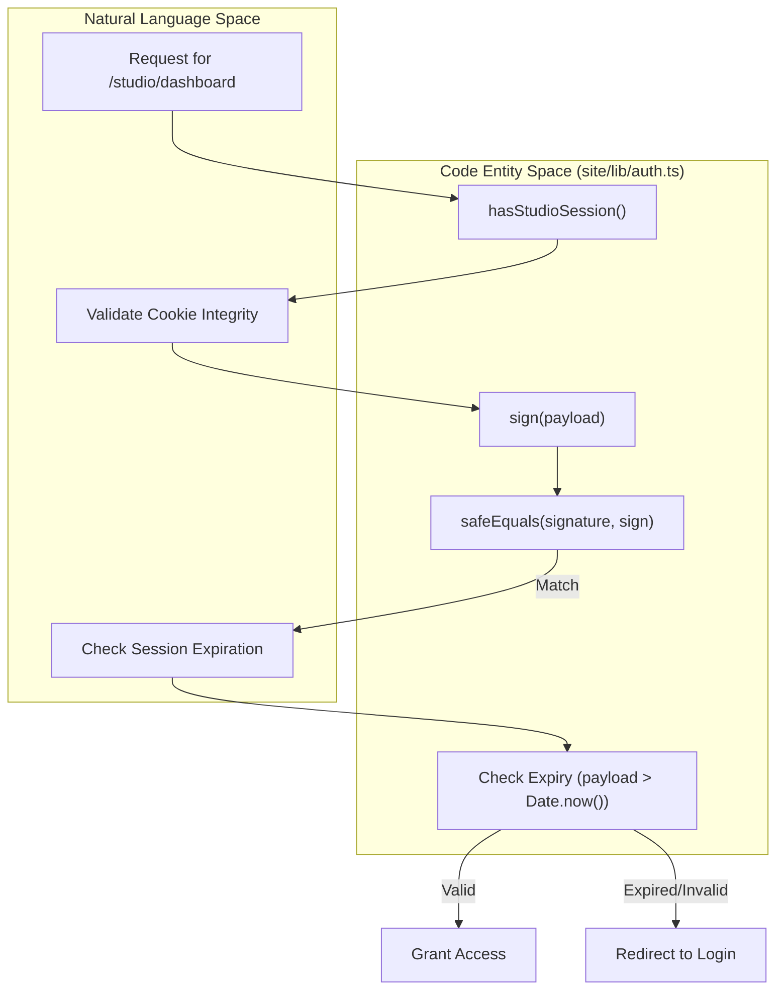

## Environment Configuration

| Variable | Required | Description |
| :--- | :--- | :--- |
| `STUDIO_PASSWORD` | Recommended | The password used to access the `/studio` dashboard. If missing, `usingDefaultStudioPassword()` returns true. |
| `SESSION_SECRET` | Recommended | Used as the HMAC key. If missing, a hardcoded fallback is used, which is insecure for production. |
| `NODE_ENV` | Internal | If set to `"production"`, the session cookie is marked as `secure`. |

---

# 3. Public-Facing Pages

<details>
<summary>Relevant source files</summary>

The following files were used as context for generating this wiki page:

- site/app/layout.tsx
- site/app/page.tsx
- site/components/site-chrome.tsx

</details>

The public-facing side of Woodsmith is designed to serve as a high-fidelity portfolio, an inquiry-based shop, a process journal, and a collaborative workspace for custom commissions. These pages are built using the Next.js App Router and rely on a combination of static data defined in `content.ts` and dynamic data stored in the SQLite database.

## Home Page (`/`)

The home page serves as the entry point to the studio's brand. It utilizes a "hero-grid" layout to showcase featured pieces and introduces the core value propositions of the studio. It dynamically pulls a subset of pieces from the static content array to populate "Signature work" and "Available now" sections.

| Section | Component | Data Source |
| :--- | :--- | :--- |
| Hero Montage | `Image` | `featuredPieces` (hardcoded indices from `pieces`) |
| Signature Work | `FeatureStack` | `pieces` array filtered for specific highlights |
| Available Now | `PieceCard` | `pieces` array filtered by `piece.status === "inventory"` |
| Commission Flow | `CommissionRequestForm` | Direct intake to `submitCommissionRequest` action |
| Journal | `JournalRail` | `journalPosts` array |

## Navigation and Layout

The application's global appearance is managed by the `RootLayout`, which injects the custom Mackintosh font stack and provides the `SiteHeader` and `SiteFooter`.

*   **`SiteHeader`**: Contains primary navigation links to Portfolio, Shop, Journal, and Commissions.
*   **`SiteFooter`**: Displays a "Piece Ledger" which is a comma-separated list of all piece names derived from the `pieceNames` constant.
*   **`mackintosh`**: A `localFont` configuration using three weights (300, 400, 600) of the ITC New Rennie Mackintosh typeface.

### Public Route Mapping

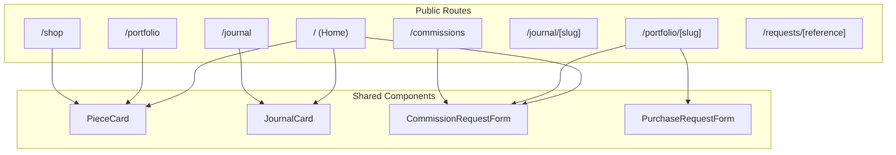

## Content and Commerce Sections

The following sections describe the primary public functional areas. Each area bridges static content (the "What") with dynamic interaction (the "How").

### Portfolio & Piece Detail Pages
The portfolio serves as the comprehensive archive of the studio's output. Individual piece pages display high-resolution galleries and contextual stories. The call-to-action (CTA) on these pages is reactive to the `PieceStatus` (e.g., showing a purchase form for inventory or a commission form for patterns).

### Shop (Inventory Reservation)
The shop specifically filters the `pieces` array for items currently in stock. Unlike a traditional e-commerce "Add to Cart" flow, Woodsmith uses an inquiry-based reservation system to maintain a direct line of communication between the maker and the buyer regarding shipping and finishing.

### Journal
The journal is a dedicated space for field notes and process documentation. It uses Markdown for body content and organizes posts by date and estimated read time.

### Commissions & Buyer Request Dossier
The commission workflow starts with a detailed intake form. Once submitted, the system generates a unique reference number and a "Dossier" page. This page becomes the permanent, shared record of the project where buyers can view status updates and post follow-up notes.

## System Data Flow: Public to Database

This diagram illustrates how public interactions (Natural Language Space) are converted into system entities (Code Entity Space) via Server Actions.

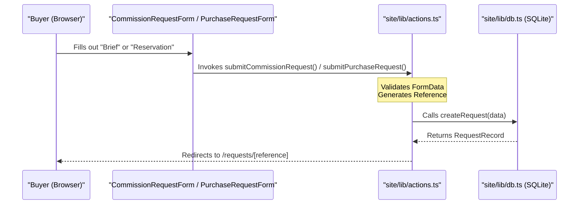

---

# 3.1 Portfolio & Piece Detail Pages

<details>
<summary>Relevant source files</summary>

The following files were used as context for generating this wiki page:

- site/app/portfolio/[slug]/page.tsx
- site/app/portfolio/page.tsx
- site/lib/content.ts

</details>

The Portfolio subsystem provides a public-facing catalog of the studio's work. It serves two primary functions: displaying a high-level grid of all available and archived work, and providing a deep-dive "Detail" page for each piece. These detail pages are the primary conversion points for the application, hosting the logic to either reserve existing inventory or initiate a custom commission.

## Portfolio Overview (`/portfolio`)

The portfolio listing page serves as the entry point for browsing the studio's catalog. It is a static page that iterates over the `pieces` array defined in the content library.

### Implementation Details
- **Data Source**: The page consumes the `pieces` array from `site/lib/content.ts`.
- **Layout**: It utilizes the `Shell` and `PageIntro` components for consistent branding.
- **Grid Rendering**: Pieces are rendered using the `PieceCard` component within a CSS grid (`piece-grid portfolio-grid`).

---

## Piece Detail Pages (`/portfolio/[slug]`)

The piece detail page provides an immersive view of a specific work, including its narrative "story," technical notes, a photo gallery, and the appropriate call-to-action (CTA) based on its availability.

### Static Generation
The route uses `generateStaticParams` to ensure all piece pages are pre-rendered at build time. It maps the `slug` property of every object in the `pieces` array to the route parameters.

### Data Flow and Logic
1. **Resolution**: The `slug` is extracted from the URL params and passed to `getPiece(slug)`.
2. **Validation**: If no piece matches the slug, the Next.js `notFound()` function is invoked.
3. **Gallery**: The `PieceGallery` component is passed the full `piece` object to render the associated media.
4. **Dynamic CTA**: The page inspects `piece.status` to determine which interaction form to display.

### Piece Detail Architecture
The following diagram illustrates how the `PiecePage` component bridges the static content definition to the interactive UI components.

**Piece Detail Entity Mapping**
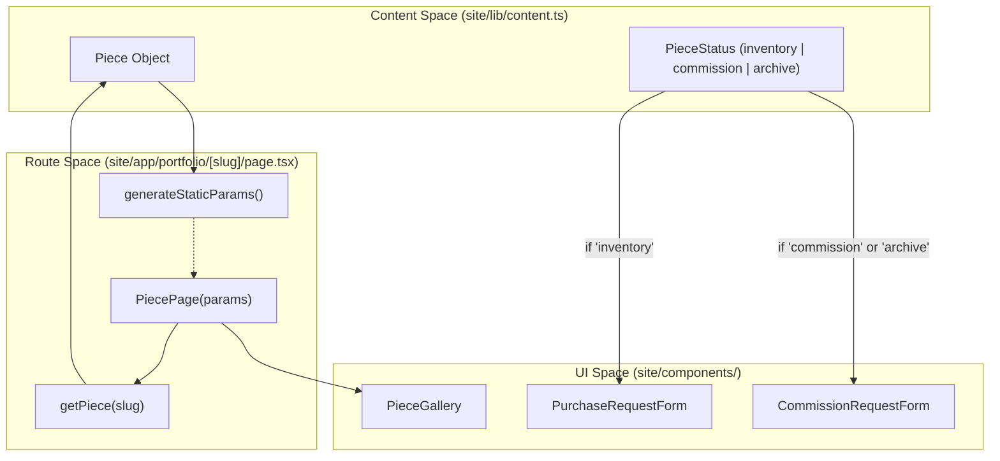

---

## Availability Logic & PieceStatus

The behavior of the detail page is driven by the `PieceStatus` enum. This determines whether a user is presented with a purchase flow (for finished items) or a commission flow (for patterns or bespoke requests).

| Status | Labeling | Form Shown | Purpose |
| :--- | :--- | :--- | :--- |
| `inventory` | "Available to reserve" | `PurchaseRequestForm` | Direct reservation of a specific, finished piece. |
| `commission` | "Build to order" | `CommissionRequestForm` | Initiating a new build based on a previous pattern. |
| `archive` | "Archive study" | `CommissionRequestForm` | Inquiring about a piece no longer in active rotation. |

### CTA Implementation
The selection logic is implemented as a ternary expression within the `PiecePage` component:
- If `piece.status === "inventory"`, the `PurchaseRequestForm` is rendered.
- Otherwise, the `CommissionRequestForm` is rendered with the `inline-form` class, pre-populated with the `pieceLabel` and `pieceSlug`.

**Status Interaction Flow**
```mermaid
sequenceDiagram
    participant User
    participant Page as "PiecePage [/portfolio/slug]"
    participant Content as site/lib/content.ts
    participant Form as "Form Component"

    User->>Page: Requests /portfolio/hallway-bench
    Page->>Content: getPiece("hallway-bench")
    Content-->>Page: Return Piece { status: "commission" }
    Page->>Page: Evaluate piece.status
    Note over Page: status is "commission"
    Page->>Form: Render CommissionRequestForm(pieceLabel, pieceSlug)
    Form-->>User: Display "Inquire about Hallway Bench"
```

---

## Key Components

### PieceGallery
Located in `site/components/site-chrome.tsx`, this component receives the `Piece` object and iterates through the `images` array. These images are resolved via the `media()` helper which points to the `/media` API route for serving assets from the `pics/` directory.

### Purchase vs. Commission Forms
- **`PurchaseRequestForm`**: Tailored for inventory. It typically handles a specific "unit" of work and triggers a `purchase` kind request in the database.
- **`CommissionRequestForm`**: Tailored for custom work. It allows the user to specify details and triggers a `commission` kind request.

---

# 3.2 Shop (Inventory Reservation)

<details>
<summary>Relevant source files</summary>

The following files were used as context for generating this wiki page:

- site/app/shop/page.tsx
- site/components/forms.tsx

</details>

The Shop system in Woodsmith provides a streamlined interface for customers to browse and reserve physical items currently held in stock. Unlike the general portfolio, the shop focuses exclusively on items with an active `inventory` status, providing a direct "reservation" path that bypasses the broader project-scoping phase of a custom commission.

## Inventory Filtering and Data Flow

The shop's content is derived from the global `pieces` array defined in the content model. The system applies a functional filter to identify items that are ready for immediate sale or short-lead-time reservation.

### Logic and Selection
Items are selected for the shop page based on their `PieceStatus`. Only pieces explicitly marked as `"inventory"` are rendered in the shop grid. This allows the studio to maintain a large portfolio of past work while only exposing currently available stock to the purchasing workflow.

### Code-to-Entity Mapping: Inventory Selection

| Entity | Code Reference | Role |
| :--- | :--- | :--- |
| **Content Source** | `pieces` | The master array of all furniture and objects. |
| **Filter Criteria** | `piece.status === "inventory"` | Predicate used to populate the shop. |
| **UI Container** | `ShopPage` | The Next.js Page component for `/shop`. |
| **Action Handler** | `submitPurchaseRequest` | Server action processing the reservation. |

## ShopPage Layout

The `ShopPage` component uses a grid-based layout to present available inventory. Each item is encapsulated in a `shop-card` which provides both visual context and the functional reservation form.

### Component Composition
1.  **Shell & PageIntro**: Provides the standard page wrapping and the "Shop" eyebrow text.
2.  **shop-grid**: A CSS grid container that iterates over the filtered `inventory` array.
3.  **shop-card**: An `<article>` element containing:
    *   **Media**: The primary image of the piece, processed via `toMediaUrl`.
    *   **Body**: Displays the category, name, summary, and lead time.
    *   **PurchaseRequestForm**: An inline form specific to that piece.

## PurchaseRequestForm Implementation

The `PurchaseRequestForm` is the primary interface for inventory reservation. It is a specialized version of the Woodsmith intake system designed for existing pieces rather than custom commissions.

### Form Fields and Constraints
*   **Read-Only Context**: The `pieceLabel` field is pre-populated with the piece name and set to `readOnly`, ensuring the request is tied to the specific inventory item.
*   **Hidden Metadata**: The form includes hidden inputs for `pieceSlug` to maintain a database-friendly reference to the content model.
*   **Customer Intake**: Collects standard contact info (Name, Email, Phone, Location) and specific logistics (Budget for variations, Timing for delivery).
*   **Reservation Note**: A required textarea for the buyer to specify delivery preferences or finish adjustments.

## Data Flow: Reservation to Database

When a user submits the `PurchaseRequestForm`, the data flows through a Next.js Server Action into the SQLite database.

### The 'purchase' Request Kind
The `submitPurchaseRequest` action processes the `FormData`. Crucially, it hardcodes the request `kind` to `'purchase'`. This distinguishes inventory reservations from `'commission'` requests in the Studio Dashboard.

### Reservation Sequence
```mermaid
sequenceDiagram
    participant B as "Buyer (Browser)"
    participant SA as "submitPurchaseRequest (Server Action)"
    participant DB as "SQLite (createRequest)"

    B->>SA: Submits PurchaseRequestForm
    Note over SA: Validates customerName, email, message
    SA->>SA: Sets kind = "purchase"
    SA->>SA: Sets status = "received"
    SA->>DB: Calls createRequest(payload)
    DB-->>SA: Returns reference (e.g., "WS-1234")
    SA->>B: Redirects to /requests/[reference]
```

### Database Persistence
The reservation is stored in the `requests` table. The `createRequest` function handles the insertion, generating a unique 4-digit reference number prefixed with "WS-".

---

# 3.3 Journal

<details>
<summary>Relevant source files</summary>

The following files were used as context for generating this wiki page:

- site/app/journal/[slug]/page.tsx
- site/app/journal/page.tsx
- site/lib/content.ts

</details>

The Journal subsystem provides a minimalist blogging platform integrated directly into the Woodsmith application. It serves as a space for technical notes on furniture construction, design philosophy, and studio updates. Unlike the portfolio, which focuses on finished pieces, the journal allows for long-form text rendering using Markdown.

## Data Model: JournalPost

Journal entries are defined as static objects within the codebase. This approach ensures that writing, images, and buyer conversations remain within the same self-hosted system without requiring an external CMS.

### The JournalPost Type
The `JournalPost` type defines the schema for every entry in the journal. It includes metadata for listing pages and a `body` field containing the raw Markdown content.

| Property | Type | Description |
| :--- | :--- | :--- |
| `slug` | `string` | Unique identifier used in the URL path. |
| `title` | `string` | The headline of the post. |
| `date` | `string` | ISO or formatted date string for chronological sorting. |
| `excerpt` | `string` | A brief summary shown on listing pages and the post header. |
| `readTime` | `string` | A manual estimate of the time required to read the post (e.g., "5 min read"). |
| `body` | `string` | The full content of the post in Markdown format. |

### Content Storage
All posts are stored in a constant array named `journalPosts` within `site/lib/content.ts`. This file also exports a helper function, `getPost(slug: string)`, which retrieves a specific post by its slug for use in dynamic routes.

## Journal Listing (`/journal`)

The journal index page renders a chronological list of all available posts. It utilizes the `PageIntro` component for the header and maps over the `journalPosts` array to generate previews.

### Implementation Details
- **Route**: `site/app/journal/page.tsx`
- **Layout**: Uses the `Shell` component to maintain consistent site margins and the `section-pad` CSS class for vertical spacing.
- **Formatting**: The `formatDate` utility is used to standardize the display of post dates.

## Individual Post Rendering (`/journal/[slug]`)

The individual post page is a dynamic route that fetches content based on the URL slug and transforms Markdown into HTML for browser rendering.

### Markdown Processing with `marked`
The application uses the `marked` library to parse the `post.body` string. This happens on the server within the `JournalPostPage` component. The resulting HTML is then injected into the article body using the `dangerouslySetInnerHTML` attribute.

### Static Generation
To ensure high performance and SEO compatibility, the journal uses `generateStaticParams`. This function iterates through the `journalPosts` array at build time to tell Next.js which slugs exist, allowing the server to pre-render every post as a static HTML file.

**Journal Post Data Flow**

```mermaid
graph TD
    subgraph "Code Entity Space"
        A["journalPosts (Array)"] -- "getPost(slug)" --> B["JournalPost Object"]
        B -- "post.body" --> C["marked.parse()"]
        C -- "html string" --> D["JournalPostPage (React)"]
    end

    subgraph "Natural Language Space"
        D -- "Renders" --> E["Individual Blog Post"]
        A -- "Mapped in" --> F["Journal Listing Page"]
    end

    style A stroke-dasharray: 5 5
    style B stroke-dasharray: 5 5
```

## UI Components

The journal experience is supported by specialized components found in the site chrome library.

### JournalCard and JournalRail
While the main `/journal` page uses a standard vertical listing, other parts of the site (such as the homepage or piece detail pages) may use the `JournalCard` or `JournalRail` components to highlight recent writing.

- **JournalCard**: A compact preview of a post, typically including the title, date, and excerpt.
- **JournalRail**: A horizontal or grid-based container used to group multiple `JournalCard` components together.

**Component Architecture**

```mermaid
graph LR
    subgraph "site/components/site-chrome.tsx"
        A["JournalCard"] --> B["Link (next/link)"]
        A --> C["formatDate"]
        D["JournalRail"] --> E["Iterates journalPosts"]
        E --> A
    end

    subgraph "site/app/journal/page.tsx"
        F["JournalPage"] --> G["article.journal-entry"]
    end
```

## Technical Implementation Summary

| Feature | Implementation |
| :--- | :--- |
| **Route Path** | `/journal` and `/journal/[slug]` |
| **Data Source** | Hardcoded array in `site/lib/content.ts` |
| **Rendering Strategy** | Static Site Generation (SSG) via `generateStaticParams` |
| **Markdown Engine** | `marked` |
| **Styling** | `.article-body` and `.journal-listing` classes in `globals.css` |

---

# 3.4 Commissions & Buyer Request Dossier

<details>
<summary>Relevant source files</summary>

The following files were used as context for generating this wiki page:

- site/app/commissions/page.tsx
- site/app/commissions/status/page.tsx
- site/app/requests/[reference]/page.tsx
- site/components/forms.tsx

</details>

The Commissions and Buyer Request system provides a continuous communication channel between the studio and the customer. It replaces fragmented email threads with a "shared dossier" (the Request Page), where project requirements, status updates, and buyer follow-ups are consolidated into a single timeline.

## Commission Intake

The `/commissions` route serves as the primary entry point for custom work. It combines educational content about the studio's process with a high-fidelity intake form and a gallery of "commission-pattern" pieces.

### Implementation Details
- **Filtering**: The page filters the global `pieces` array for items with `status === "commission"`.
- **Layout**: Uses a `split-section` layout to display the three-step process overview alongside the `CommissionRequestForm`.
- **Pattern Gallery**: Displays `PieceCard` components for pieces that serve as templates for future commissions.

### Commission Request Form
The `CommissionRequestForm` captures comprehensive project data, including:
- **Project Type**: A dropdown populated from `commissionOptions`.
- **Logistics**: Budget, timing, location, and contact details.
- **Specifications**: Materials, finish, and dimensions.
- **Brief**: A required long-form textarea for the project vision.

## Status Lookup

The `/commissions/status` route allows buyers to return to their project dossier if they have lost their direct link.

### Lookup Logic
The page uses `searchParams` to perform a database query. It requires both the unique **Reference Number** and the **Email Address** associated with the request to grant access.

1. **Query**: Calls `findRequestForLookup(reference, email)`.
2. **Timeline Fetch**: If found, it retrieves only "public" updates via `getRequestUpdates(reference, "public")`.
3. **Display**: Renders a `RequestSummary` and a direct link to the persistent dossier URL.

## The Buyer Request Dossier

The dossier page at `/requests/[reference]` is the permanent, shared record for a specific project. It is accessible to the buyer via a unique URL generated upon submission.

### Page Components
- **RequestSummary**: Displays the current status (e.g., "Inquiry", "Active"), the original project brief, and a chronological timeline of updates.
- **Timeline Updates**: Lists all public messages sent by the studio or follow-ups sent by the buyer.
- **BuyerUpdateForm**: Allows the customer to post new information (measurements, photos, questions) directly to the timeline.

### Security and Validation
While the URL contains a unique reference, the `BuyerUpdateForm` requires the user to re-input their email. The `submitBuyerUpdate` server action validates this email against the database record before committing the update; if it fails, the user is redirected back with an `error` flag.

## Data Flow: Inquiry to Dossier

The following diagram illustrates how a customer submission moves from the React form through Server Actions into the SQLite database, and how it is subsequently retrieved for the Dossier view.

### Request Submission and Retrieval Flow
```mermaid
sequenceDiagram
    participant B as "Browser (/commissions)"
    participant SA as "submitCommissionRequest (Server Action)"
    participant DB as "SQLite (requests table)"
    participant D as "Dossier (/requests/[reference])"

    B->>SA: POST Form Data (pieceLabel, email, message, etc.)
    SA->>SA: Generate Reference (WS-CM-...)
    SA->>DB: createRequest(data)
    SA-->>B: Redirect to /requests/[reference]?created=1
    
    Note over B, D: Subsequent Visit
    
    B->>D: GET /requests/[reference]
    D->>DB: getRequestByReference(reference)
    D->>DB: getRequestUpdates(reference, "public")
    DB-->>D: RequestRecord + Update[]
    D-->>B: Render RequestSummary + BuyerUpdateForm
```

## Code Entity Mapping

This diagram maps the natural language concepts of the Commission system to the specific code entities that implement them.

### System Entity Map
```mermaid
graph TD
    subgraph "Natural Language Space"
        Inquiry["Commission Inquiry"]
        Dossier["Project Dossier"]
        Timeline["Timeline Update"]
        Lookup["Status Lookup"]
    end

    subgraph "Code Entity Space"
        C_Form["CommissionRequestForm (forms.tsx)"]
        S_Action["submitCommissionRequest (actions.ts)"]
        B_Action["submitBuyerUpdate (actions.ts)"]
        R_Page["RequestPage (app/requests/[reference]/page.tsx)"]
        DB_Func["createRequest (db.ts)"]
        DB_Lookup["findRequestForLookup (db.ts)"]
        Status_P["CommissionStatusPage (app/commissions/status/page.tsx)"]
    end

    Inquiry --> C_Form
    C_Form --> S_Action
    S_Action --> DB_Func
    
    Dossier --> R_Page
    R_Page --> B_Action
    
    Timeline --> B_Action
    
    Lookup --> Status_P
    Status_P --> DB_Lookup
```

---

# 4. Studio Dashboard (Admin Interface)

<details>
<summary>Relevant source files</summary>

The following files were used as context for generating this wiki page:

- site/app/studio/login/page.tsx
- site/app/studio/page.tsx
- site/app/studio/request/[reference]/page.tsx
- site/lib/auth.ts

</details>

The Studio Dashboard is the administrative nerve center of Woodsmith, located at the `/studio` route. It provides a password-protected interface for the artisan to manage commission briefs, shop inquiries, and project timelines. The dashboard aggregates data from the SQLite database to provide a bird's-eye view of all active and historical requests.

## Administrative Overview

Access to the studio is restricted via a session-based authentication system. Once authenticated, the artisan can view high-level statistics, browse a sortable table of all requests, and drill down into individual dossier management pages.

### Studio Flow & Code Entities

The following diagram maps the high-level admin workflow to the specific code entities responsible for each stage.

```mermaid
graph TD
    subgraph "Auth Space"
        A["/studio/login"] --> B["StudioLoginForm"]
        B -- "loginStudioAction" --> C["createStudioSession"]
    end

    subgraph "Dashboard Space"
        C --> D["/studio (StudioDashboardPage)"]
        D -- "getDashboardSummary" --> E["Summary Stats"]
        D -- "listRequests" --> F["DashboardTable"]
    end

    subgraph "Detail Space"
        F -- "Reference Link" --> G["/studio/request/[reference]"]
        G -- "StudioRequestForm" --> H["updateStudioRequestAction"]
    end

    style A stroke-dasharray: 5 5
    style D stroke-dasharray: 5 5
    style G stroke-dasharray: 5 5
```

## Authentication and Security

The studio is protected by a single global password defined by the `STUDIO_PASSWORD` environment variable.

- **Login Flow**: Users must enter the password via the `StudioLoginForm`. Upon success, an HMAC-signed cookie (`woodsmith_studio`) is issued.
- **Session Enforcement**: Every route under `/studio` (except `/login`) invokes `requireStudioSession()`. If the session is missing or invalid, the user is redirected to the login page.
- **Security Warning**: If no `STUDIO_PASSWORD` is set, the system defaults to a fallback password and displays a prominent warning in the UI.

For details, see [Studio Login & Session Management](#41-studio-login--session-management).

## The Dashboard Interface

The main landing page (`/studio/page.tsx`) serves as the command center for the artisan.

### Summary Statistics
The dashboard displays four key metrics retrieved via `getDashboardSummary()`:
- **Total Requests**: Every entry in the `requests` table.
- **Commission Briefs**: Requests with `kind = 'commission'`.
- **Shop Inquiries**: Requests with `kind = 'purchase'`.
- **Open Dossiers**: Requests that have not yet reached a terminal state (e.g., "Completed" or "Cancelled").

### Request Navigation
The `DashboardTable` component lists all requests in reverse chronological order. It provides a high-level view of the buyer name, piece name, current status, and a link to the detailed dossier.

| Feature | Component / Function | Purpose |
| :--- | :--- | :--- |
| **Stats Grid** | `getDashboardSummary` | Quick glance at workload volume |
| **Request List** | `DashboardTable` | Sorting and navigating through all inquiries |
| **Global Controls** | `StudioToolbar` | Logout and quick navigation actions |

## Request Management

Clicking a request in the dashboard opens the detail page (`/studio/request/[reference]`). This page is the primary interface for interacting with a buyer's request.

### Studio Controls
The `StudioRequestForm` allows the artisan to modify the internal and external state of a request:
- **Public Status**: Updates the badge seen by the buyer (e.g., "In Progress", "Shipping").
- **Admin Stage**: Internal workflow tracking (e.g., "Materials Sourced").
- **Notes**: Internal-only scratchpad for the artisan.
- **Timeline Updates**: Appending messages to the dossier. These can be flagged as "Public" (visible to the buyer) or "Private" (internal record).

For details, see [Request Management (Studio Controls)](#42-request-management-studio-controls).

---

# 4.1 Studio Login & Session Management

<details>
<summary>Relevant source files</summary>

The following files were used as context for generating this wiki page:

- site/app/studio/login/page.tsx
- site/lib/actions.ts
- site/lib/auth.ts

</details>

The Studio section of Woodsmith is a protected administrative interface. Access is controlled via a single-password authentication system that utilizes HMAC-signed cookies for session persistence. This system ensures that only authorized users can manage commission requests, update project statuses, and post internal notes.

## Authentication Configuration

Woodsmith uses environment variables to manage credentials and session security. If these variables are not provided, the system falls back to insecure defaults, which triggers a warning in the UI.

| Variable | Description | Default (Fallback) |
| :--- | :--- | :--- |
| `STUDIO_PASSWORD` | The password required to log into the `/studio` dashboard. | `woodsmith-studio` |
| `SESSION_SECRET` | A secret key used to generate HMAC signatures for session cookies. | `woodsmith-session-secret` |

The helper function `usingDefaultStudioPassword` checks if `STUDIO_PASSWORD` is defined in the environment. This status is reflected on the login page to alert administrators to set proper credentials before public deployment.

---

## Login Flow & Session Creation

The login process is initiated via the `StudioLoginForm` component, which invokes the `loginStudioAction` server action.

### 1. Password Verification
The system uses `timingSafeEqual` from `node:crypto` to compare the provided password against the configured `STUDIO_PASSWORD`. This prevents timing attacks that could reveal the password length or content.

### 2. Session Signing (HMAC)
Upon successful verification, `createStudioSession` generates a signed cookie:
1. **Payload**: A timestamp representing the expiration date (7 days from creation).
2. **Signature**: An HMAC-SHA256 hash of the payload using `SESSION_SECRET`.
3. **Token**: The payload and signature joined by a dot (`payload.signature`).

### 3. Cookie Storage
The token is stored in a cookie named `woodsmith_studio` with the following security attributes:
- `httpOnly`: True (prevents JavaScript access).
- `sameSite`: "lax".
- `secure`: True in production environments.

### Logic Flow: Studio Login
The following diagram illustrates the transition from the UI form to the server-side session creation.

```mermaid
sequenceDiagram
    participant UI as "StudioLoginForm [site/components/forms.tsx]"
    participant Action as "loginStudioAction [site/lib/actions.ts]"
    participant Auth as "auth.ts [site/lib/auth.ts]"
    participant Cookie as "browser_cookies"

    UI->>Action: "POST (password)"
    Action->>Auth: "verifyStudioPassword(password)"
    Auth-->>Action: "boolean (safeEquals)"
    
    alt "Success"
        Action->>Auth: "createStudioSession()"
        Auth->>Auth: "sign(payload)"
        Auth->>Cookie: "set woodsmith_studio"
        Action->>UI: "redirect(/studio)"
    else "Failure"
        Action->>UI: "redirect(/studio/login?error=1)"
    end
```

---

## Session Verification

Every protected route and administrative server action must verify the session integrity. This is handled by `hasStudioSession` and enforced by `requireStudioSession`.

### Verification Logic
To validate a session, the system:
1. Retrieves the `woodsmith_studio` cookie.
2. Splits the token into `payload` and `signature`.
3. Re-calculates the HMAC of the `payload` and compares it to the `signature` using `safeEquals`.
4. Checks if the `payload` (expiration timestamp) is greater than the current time.

### Enforcement
The `requireStudioSession` function is called at the start of sensitive server actions, such as `updateStudioRequestAction`, to ensure the user is still authenticated. If verification fails, the user is redirected to the login page.

### Data Flow: Protected Action
The diagram below shows how session verification guards database updates.

```mermaid
flowchart TD
    subgraph "Server Action Space"
        A["updateStudioRequestAction [site/lib/actions.ts]"]
    end

    subgraph "Auth Logic Space"
        B["requireStudioSession [site/lib/auth.ts]"]
        C["hasStudioSession [site/lib/auth.ts]"]
        D["sign [site/lib/auth.ts]"]
    end

    subgraph "Database Space"
        E["updateRequest [site/lib/db.ts]"]
    end

    A --> B
    B --> C
    C --> D
    
    C -- "Valid Signature & Not Expired" --> A
    A -- "Update Fields" --> E
    
    C -- "Invalid" --> F["redirect(/studio/login)"]
```

---

## Logout

The logout process is straightforward. The `logoutStudioAction` server action calls `clearStudioSession`, which instructs the browser to delete the `woodsmith_studio` cookie. After the session is cleared, the user is redirected to the home page.

---

# 4.2 Request Management (Studio Controls)

<details>
<summary>Relevant source files</summary>

The following files were used as context for generating this wiki page:

- site/app/studio/page.tsx
- site/app/studio/request/[reference]/page.tsx
- site/components/forms.tsx
- site/components/site-chrome.tsx
- site/lib/db.ts

</details>

The Request Management system provides the administrative interface for managing buyer inquiries, commission dossiers, and shop reservations. It allows the studio to track the progress of projects, maintain internal notes, and communicate with buyers through a shared timeline.

## Studio Dashboard

The Studio Dashboard is the primary entry point for administrative tasks. It requires a valid studio session to access, enforced by `requireStudioSession`.

### Data Aggregation
The dashboard presents a high-level summary of all site activity using `getDashboardSummary()`, which calculates:
*   **Total Requests**: All entries in the `requests` table.
*   **Commission Briefs**: Requests where `kind` is `commission`.
*   **Shop Inquiries**: Requests where `kind` is `purchase`.
*   **Open Dossiers**: Requests where the `status` is not "Completed" or "Closed".

### Dashboard Table
The `DashboardTable` component displays the list of requests fetched by `listRequests()`. It provides a sortable view of:
*   **Reference**: The unique identifier (e.g., `WS-CM-230512-A1B2`).
*   **Kind**: Commission vs. Purchase.
*   **Client**: Customer name and email.
*   **Status/Stage**: The current public status and internal administrative stage.
*   **Date**: When the request was created.

## Per-Request Detail Page

The detail page at `/studio/request/[reference]` provides the granular controls for a specific dossier. It combines a read-only summary of the buyer's original request with the administrative `StudioRequestForm`.

### Data Flow: Studio Detail
The page retrieves the request record and its full history (including private updates) before rendering.

| Entity | Source Function | Scope |
| :--- | :--- | :--- |
| **Request Record** | `getRequestByReference(reference)` | Core metadata (Client, Status, Notes) |
| **Timeline Updates** | `getRequestUpdates(reference, "all")` | Public and Private messages |

## Studio Controls (StudioRequestForm)

The `StudioRequestForm` is the primary tool for request lifecycle management. It maps directly to fields in the `requests` and `request_updates` tables.

### Field Definitions
*   **Status**: The public-facing status (e.g., "Inquiry", "Building", "Shipped").
*   **Stage**: The internal administrative stage (e.g., "Awaiting Deposit", "Queued").
*   **Public Notes**: Persistent information visible to the buyer on their dossier page.
*   **Internal Notes**: Private notes visible only to the studio in the dashboard.
*   **Timeline Message**: An optional message to append to the request history.
*   **Message Visibility**: A toggle (`public` or `private`) determining if the timeline message is visible to the buyer.

### Update Implementation
The form submits to `updateStudioRequestAction`, which performs the following:
1.  **Validation**: Verifies the studio session and extracts `FormData`.
2.  **Database Update**: Calls `updateRequest()` to save status and notes.
3.  **Timeline Append**: If a `studioMessage` is provided, it calls `appendRequestUpdate()` with the specified `visibility`.
4.  **Revalidation**: Triggers `revalidatePath` for both the studio view and the public buyer dossier to ensure data consistency.

## Timeline & Visibility Logic

The system distinguishes between data intended for the studio and data intended for the buyer. This is handled via the `visibility` column in the `request_updates` table and specific fields in the `requests` table.

### Public vs. Private Updates
The `getRequestUpdates` function filters data based on the caller's context.

```mermaid
graph TD
    subgraph "Code Entity Space"
        A["getRequestUpdates(ref, scope)"]
        B["db.prepare(SELECT * FROM request_updates)"]
        C["scope === 'public'"]
        D["scope === 'all'"]
    end

    subgraph "Natural Language Space"
        E["Buyer Dossier View"]
        F["Studio Detail View"]
    end

    E --> C
    F --> D
    C -->|"WHERE visibility = 'public'"| B
    D -->|"No visibility filter"| B
    B --> G["RequestUpdateRecord[]"]
```

### Visibility Mapping

| Data Point | Database Field | Visible to Buyer? | Purpose |
| :--- | :--- | :--- | :--- |
| **Status** | `status` | Yes | High-level project state. |
| **Admin Stage** | `admin_stage` | Yes | Specific progress indicator. |
| **Public Notes** | `public_notes` | Yes | Instructions or summaries for the buyer. |
| **Internal Notes** | `internal_notes` | No | Private studio-only context. |
| **Public Update** | `visibility: 'public'` | Yes | Correspondence/Milestones. |
| **Private Update** | `visibility: 'private'` | No | Internal logs/Reminders. |

## Request Management Data Flow

```mermaid
sequenceDiagram
    participant Studio as "StudioRequestForm"
    participant Action as "updateStudioRequestAction"
    participant DB as "DatabaseSync (woodsmith.sqlite)"
    participant Cache as "Next.js Revalidation"

    Studio->>Action: POST FormData (status, notes, message)
    Action->>Action: requireStudioSession()
    Action->>DB: updateRequest(reference, fields)
    Note over DB: UPDATE requests SET status, public_notes...
    
    alt If studioMessage exists
        Action->>DB: appendRequestUpdate(reference, message, visibility)
        Note over DB: INSERT INTO request_updates...
    end

    Action->>Cache: revalidatePath("/studio/request/[reference]")
    Action->>Cache: revalidatePath("/requests/[reference]")
    Action-->>Studio: Redirect with ?saved=1
```

---

# 5. UI Components & Styling

<details>
<summary>Relevant source files</summary>

The following files were used as context for generating this wiki page:

- site/app/globals.css
- site/components/forms.tsx
- site/components/site-chrome.tsx

</details>

Woodsmith employs a cohesive design system built on a custom global CSS framework and a library of reusable React components. The UI is designed to reflect the craftsmanship of the furniture it showcases, utilizing a refined color palette, a bespoke typography stack, and a consistent layout grid.

## Design System Overview

The visual identity of Woodsmith is defined in `site/app/globals.css`. It uses a set of CSS custom properties for its color palette (e.g., `--ink`, `--cedar`, `--lacquer`) and typography tokens. The system is built around the **ITC New Rennie Mackintosh** font family, which is integrated via a local font stack.

### Visual Composition Logic
The following diagram illustrates how global styles and layout primitives provide the foundation for specific UI components.

**Design System Hierarchy**
```mermaid
graph TD
    subgraph "Natural Language Space"
        A["Brand Identity"]
        B["Layout Primitives"]
        C["Visual Texture"]
    end

    subgraph "Code Entity Space"
        A --> D[":root vars"]
        D --> D1["--ink: #221913"]
        D --> D2["--cedar: #915f3c"]
        
        B --> E[".shell"]
        B --> F[".section-pad"]
        B --> G[".field-grid"]
        
        C --> H["body::before (Grid Overlay)"]
        C --> I[".site-backdrop (Gradients)"]
    end
```

For details on tokens, breakpoints, and layout classes, see **[Design System & Global CSS](#53-design-system--global-css)**.

---

## Site Chrome Components

The "Chrome" refers to the structural and navigational elements that persist across the site, as well as the content-display components used to build pages. These are primarily defined in `site/components/site-chrome.tsx`.

| Component | Role | Key Props |
| :--- | :--- | :--- |
| `Shell` | Main content container with max-width | `children`, `className` |
| `SiteHeader` | Sticky navigation bar with brand mark | N/A |
| `PieceCard` | Grid item for portfolio listings | `piece: Piece` |
| `FeatureStack` | High-impact vertical list for home/portfolio | `pieces: Piece[]` |
| `RequestSummary` | The core display for buyer dossiers | `request`, `updates` |

For a full catalog of these components and their usage, see **[Site Chrome Components](#51-site-chrome-components)**.

---

## Form Components

Forms in Woodsmith are standardized to handle data entry for commissions, purchases, and studio management. They are defined in `site/components/forms.tsx` and are tightly coupled with Next.js Server Actions for data persistence.

**Form to Action Mapping**
```mermaid
graph LR
    subgraph "UI Components (forms.tsx)"
        F1["CommissionRequestForm"]
        F2["PurchaseRequestForm"]
        F3["StudioRequestForm"]
    end

    subgraph "Server Actions (lib/actions.ts)"
        A1["submitCommissionRequest"]
        A2["submitPurchaseRequest"]
        A3["updateStudioRequestAction"]
    end

    F1 -- "action=" --> A1
    F2 -- "action=" --> A2
    F3 -- "action=" --> A3
```

### Key Form Features:
*   **Validation:** Uses native HTML5 validation (e.g., `required`, `type="email"`) combined with server-side processing.
*   **Hidden Fields:** Pass critical context like `pieceSlug` or `reference` without user input.
*   **Styling:** Utilizes `.field-grid` for responsive multi-column layouts.

For implementation details and validation patterns, see **[Form Components](#52-form-components)**.

---

## Child Pages

*   **[Site Chrome Components](#51-site-chrome-components)**: Deep dive into the visual building blocks of the site.
*   **[Form Components](#52-form-components)**: Technical details on data entry and server action wiring.
*   **[Design System & Global CSS](#53-design-system--global-css)**: Documentation of the CSS architecture and typography.

---

# 5.1 Site Chrome Components

<details>
<summary>Relevant source files</summary>

The following files were used as context for generating this wiki page:

- site/components/site-chrome.tsx
- site/lib/content.ts
- site/lib/format.ts

</details>

This page documents the shared UI components exported from `site/components/site-chrome.tsx`. These components form the "chrome" and structural layout of the Woodsmith application, providing a consistent visual language across the portfolio, journal, and studio dashboard.

The components are built using React and Next.js, leveraging `next/image` for optimized media delivery and `next/link` for client-side navigation.

### Component Hierarchy and Composition

The following diagram illustrates how the top-level layout components compose a standard page.

**Page Composition Diagram**
```mermaid
graph TD
    subgraph "Layout Structure"
        Shell["Shell (site-chrome.tsx)"]
        Header["SiteHeader (site-chrome.tsx)"]
        Footer["SiteFooter (site-chrome.tsx)"]
        Main["Page Content (<main>)"]
    end

    subgraph "Content Components"
        Intro["PageIntro"]
        Heading["SectionHeading"]
        Grid["PieceCard / JournalCard"]
        Gallery["PieceGallery"]
    end

    Shell --> Header
    Shell --> Main
    Shell --> Footer
    Main --> Intro
    Main --> Heading
    Main --> Grid
    Main --> Gallery
```

---

## Layout Primitives

### Shell
The `Shell` component is the primary layout constraint. It applies the `.shell` CSS class to ensure consistent horizontal padding and maximum width across the application.

*   **Props**: `children: ReactNode`, `className?: string`.
*   **Usage**: Wrapped around headers, footers, and main content sections to align them to the site's grid.

### SiteHeader
The global navigation bar. It includes the "Woodsmith" brand mark and primary navigation links to Portfolio, Shop, Journal, Commissions, and the Studio login.

### SiteFooter
The global footer containing the site's philosophy, a "Piece Ledger" (a list of all piece names joined by slashes), and a brief description of the "Flow" (the inquiry-to-delivery process). It pulls data from `pieceNames` defined in the content library.

---

## Content Presentation

### PageIntro & SectionHeading
These components provide standardized typography for page starts and section breaks.
*   **PageIntro**: Uses an `h1` and a large "lede" paragraph.
*   **SectionHeading**: Uses an `h2` and standard paragraph.
*   **Common Props**: `eyebrow` (small uppercase text above title), `title`, and `copy`.

### DividerBand
A decorative structural element that displays a horizontal list of all `pieceNames`. It acts as a signature marquee between major page sections.

### PieceCard
A grid-based card used in the portfolio and shop.
*   **Implementation**: Displays the primary image (index 0), category, a status badge (e.g., "inventory", "commission"), and a summary.
*   **Status Badges**: The badge class is dynamically generated as `status-${piece.status}` to allow for status-specific styling (e.g., green for inventory, grey for archive).

### FeatureStack
A vertical list of high-priority pieces, often used on the homepage.
*   **Implementation**: Maps through an array of `Piece` objects, assigning a leading zero index (e.g., "01", "02") to each entry.
*   **Layout**: Uses a "feature-card" class that typically balances copy and media in a split layout.

### PieceGallery
The primary image display for individual piece detail pages.
*   **Implementation**: Iterates through the `piece.images` array and renders them inside `figure` elements.
*   **Media Handling**: Uses the `toMediaUrl` helper to transform internal paths (e.g., `Furniture/DSC_0051.JPG`) into public `/media/` routes.

---

## Journal Components

### JournalCard
A compact summary of a journal entry, displaying the formatted date, estimated read time, title, and excerpt. It uses `formatDate` from the format library to localize the ISO date string.

### JournalRail
A layout component that renders a horizontal or vertical list of all available `journalPosts` using `JournalCard`.

---

## Request & Dashboard Components

These components bridge the public-facing "Buyer Dossier" and the internal "Studio Dashboard."

**Data Flow: Database to Component**
```mermaid
graph LR
    subgraph "Database (db.ts)"
        ReqRec["RequestRecord"]
        UpdRec["RequestUpdateRecord"]
    end

    subgraph "Site Chrome (site-chrome.tsx)"
        RS["RequestSummary"]
        DT["DashboardTable"]
    end

    ReqRec --> RS
    UpdRec --> RS
    ReqRec --> DT
```

### RequestSummary
The primary view for a specific commission or purchase request. It is used both by customers (at `/requests/[reference]`) and the studio admin.
*   **Props**:
    *   `request`: The `RequestRecord` from the database.
    *   `updates`: An array of `RequestUpdateRecord` (the timeline/history).
    *   `privateView`: A boolean that, when true, reveals internal notes and non-public updates.
*   **Sections**:
    *   **Project Brief**: A definition list (`dl`) showing client contact info and project specs (budget, dimensions, materials).
    *   **Timeline**: Renders the history of the request. If `privateView` is false, it filters out updates where `messageVisibility` is set to "private".

### DashboardTable
A tabular view of all requests, used exclusively in the Studio Dashboard.
*   **Functionality**: Displays a list of `RequestRecord` objects, including the reference number, customer name, piece label, current status, and admin stage.
*   **Navigation**: Each row contains a "Manage" link pointing to the detail editor at `/studio/request/[reference]`.

---

# 5.2 Form Components

<details>
<summary>Relevant source files</summary>

The following files were used as context for generating this wiki page:

- site/components/forms.tsx
- site/lib/actions.ts

</details>

The `site/components/forms.tsx` file contains all interactive form components used across the Woodsmith application. These components are responsible for capturing user input for commission requests, inventory reservations, buyer updates, and administrative studio management. Every form is implemented as a React client component (implicitly or explicitly) that leverages Next.js **Server Actions** for data processing and persistence.

## Data Flow Overview

The forms follow a consistent pattern: they collect data via standard HTML inputs, submit that data to a Server Action defined in `site/lib/actions.ts`, which then interacts with the SQLite database via `site/lib/db.ts`.

### Form to Action Mapping

| Form Component | Server Action | Target Table / Operation |
| :--- | :--- | :--- |
| `CommissionRequestForm` | `submitCommissionRequest` | `requests` (INSERT) |
| `PurchaseRequestForm` | `submitPurchaseRequest` | `requests` (INSERT) |
| `BuyerUpdateForm` | `submitBuyerUpdate` | `request_updates` (INSERT) |
| `StudioLoginForm` | `loginStudioAction` | Session Cookie Creation |
| `StudioToolbar` | `logoutStudioAction` | Session Cookie Deletion |
| `StudioRequestForm` | `updateStudioRequestAction` | `requests` (UPDATE) & `request_updates` (INSERT) |

### System Entity Mapping

This diagram illustrates how Natural Language concepts (e.g., "Starting a commission") map to specific code entities within the Woodsmith architecture.

**Natural Language to Code Entity Space**
```mermaid
graph TD
    subgraph "Natural Language Space"
        A["'I want to order a custom table'"]
        B["'I want to buy this specific chair'"]
        C["'Where is my order?'"]
        D["'I finished the legs today'"]
    end

    subgraph "Code Entity Space"
        A --> E["CommissionRequestForm"]
        B --> F["PurchaseRequestForm"]
        C --> G["BuyerUpdateForm"]
        D --> H["StudioRequestForm"]

        E --> I["submitCommissionRequest()"]
        F --> J["submitPurchaseRequest()"]
        G --> K["submitBuyerUpdate()"]
        H --> L["updateStudioRequestAction()"]

        I & J --> M["createRequest()"]
        K & L --> N["appendRequestUpdate()"]
        L --> O["updateRequest()"]
    end
```

---

## Public Intake Forms

These forms are accessible to customers and are used to initiate or track requests.

### CommissionRequestForm
Used on the `/commissions` page and piece detail pages to start a custom project.

*   **Props**:
    *   `pieceLabel`: Optional default value for the "Project type" dropdown.
    *   `pieceSlug`: Optional hidden field to associate the request with a specific portfolio piece.
*   **Validation**: Uses `required` attributes on `pieceLabel`, `customerName`, `email`, and `message`.
*   **Implementation**: Dynamically populates the "Project type" dropdown from `commissionOptions` defined in the content library.

### PurchaseRequestForm
Used on the `/shop` and piece detail pages for existing inventory.

*   **Props**:
    *   `piece`: Requires a `Piece` object to pre-fill the label and slug.
*   **Hidden Fields**: Automatically sets `pieceSlug`, `materials`, and `dimensions` (empty strings) to satisfy the database schema for purchase requests.
*   **Workflow**: Submitting this form sets the request `kind` to `"purchase"` and the initial `adminStage` to `"Confirming availability"`.

### BuyerUpdateForm
Allows customers to post messages to their specific request timeline.

*   **Props**: `request` (a `RequestRecord` object).
*   **Security**: Requires the customer to provide their email alongside the reference number (via `findRequestForLookup`) to prevent unauthorized updates.
*   **Data Flow**: Appends a new row to `request_updates` with `authorRole: "buyer"` and `visibility: "public"`.

---

## Studio Management Forms

These forms are restricted to the authenticated Studio area.

### StudioLoginForm
A simple password entry form that triggers `loginStudioAction`. It uses a standard HTML password input to obscure the `STUDIO_PASSWORD` during entry.

### StudioToolbar
Contains the logout button which triggers `logoutStudioAction` to clear the HMAC-signed session cookie.

### StudioRequestForm
The primary interface for the studio to manage a request's lifecycle.

*   **Key Fields**:
    *   `status`: Public-facing status string (e.g., "In Progress").
    *   `adminStage`: Internal-facing stage for dashboard organization.
    *   `publicNotes`: Notes visible to the buyer on their dossier.
    *   `internalNotes`: Private notes visible only in the Studio dashboard.
    *   `studioMessage`: A new timeline update.
    *   `messageVisibility`: A toggle (radio buttons) to determine if the `studioMessage` is `public` or `private`.

**Studio Request Update Logic**
```mermaid
sequenceDiagram
    participant UI as StudioRequestForm
    participant SA as updateStudioRequestAction
    participant DB as SQLite (db.ts)

    UI->>SA: Submit FormData
    SA->>SA: requireStudioSession()
    SA->>DB: updateRequest(reference, {status, adminStage, notes})
    alt studioMessage is present
        SA->>DB: appendRequestUpdate(reference, authorRole: "studio", visibility)
    end
    SA->>SA: revalidatePath()
    SA->>UI: Redirect with ?saved=1
```

---

## Field Validation Patterns

The application uses two helper functions in `site/lib/actions.ts` to process `FormData` consistently:

1.  **`requiredField(value, label)`**: Trims the input and throws an Error if the value is missing or empty. This error is caught by the Next.js action handler.
2.  **`optionalField(value)`**: Trims the input and returns an empty string if the value is null or empty, ensuring no `null` values are passed to database fields expecting strings.

### Common CSS Classes
Forms are styled using a set of global utility classes defined in `site/app/globals.css`:
*   `.request-form`: The base container with spacing and layout.
*   `.field-grid`: A grid container for inputs.
    *   `.two-up`: Two columns.
    *   `.three-up`: Three columns.
*   `.button-primary` / `.button-secondary`: Standardized action styling.

---

# 5.3 Design System & Global CSS

<details>
<summary>Relevant source files</summary>

The following files were used as context for generating this wiki page:

- site/app/globals.css
- site/app/layout.tsx
- site/fonts/mackintosh-light.otf
- site/fonts/mackintosh-regular.otf
- site/fonts/mackintosh-semibold.otf

</details>

The Woodsmith design system is a bespoke visual framework centered around the **ITC New Rennie Mackintosh** typography stack and a material-inspired color palette (Cedar, Lacquer, Moss). It is implemented primarily through CSS custom properties and utility classes within a single global stylesheet, designed to provide a cohesive aesthetic across both the public portfolio and the private studio dashboard.

## Color Palette & Typography Tokens

The system uses CSS custom properties defined in the `:root` selector to manage its visual identity. The palette is designed to evoke woodworking materials: "Paper" for backgrounds, "Cedar" and "Moss" for accents, and "Lacquer" for highlights.

### Color Tokens
| Variable | Value | Usage |
| :--- | :--- | :--- |
| `--ink` | `#221913` | Primary text color |
| `--ink-soft` | `#4e3d31` | Secondary/Lede text |
| `--paper` | `#f3ede3` | Main page background |
| `--cedar` | `#915f3c` | Wood-tone accents |
| `--lacquer` | `#8a2f20` | Brand highlights and eyebrows |
| `--moss` | `#6f7d60` | Secondary accents |

### Typography: The Mackintosh Stack
The application uses a local font configuration via `next/font/local` to load the ITC New Rennie Mackintosh family.

*   **Weights Loaded**: Light (300), Regular (400), and Semibold (600).
*   **Variable Name**: `--font-woodsmith`.
*   **Fallback**: `Times New Roman`, serif.

The font is injected into the HTML class list and assigned to the `--font-site` property.

**Design-to-Code Mapping: Tokens**
```mermaid
graph TD
    subgraph "Natural Language Space"
        A["Primary Brand Font"]
        B["Background Color"]
        C["Highlight Red"]
    end

    subgraph "Code Entity Space (site/app/globals.css)"
        A --> A1["--font-woodsmith"]
        B --> B1["--paper"]
        C --> C1["--lacquer"]
    end

    subgraph "Asset Space (site/fonts/)"
        A1 --> F1["mackintosh-regular.otf"]
        A1 --> F2["mackintosh-light.otf"]
        A1 --> F3["mackintosh-semibold.otf"]
    end
```

## Layout Primitives

Woodsmith relies on a set of standardized CSS classes to manage spacing and responsive grids.

### The Shell and Spacing
*   **`.shell`**: Restricts content width to a maximum of `1180px` or `100vw` minus padding, centered via `margin: 0 auto`.
*   **`.section-pad`**: Standard vertical rhythm with `4.5rem` padding.

### Grid Systems
The layout uses CSS Grid extensively for structural components:
*   **`.hero-grid` / `.split-section`**: A two-column layout for major page sections, typically using a `1.05fr` to `0.95fr` ratio.
*   **`.hero-montage`**: A complex grid for the homepage hero, featuring a main image and a vertical stack of secondary images.
*   **`.piece-grid` / `.shop-grid`**: Responsive grids for displaying collections of items.

**Structural Data Flow**
```mermaid
graph TD
    subgraph "RootLayout (site/app/layout.tsx)"
        L["body"] --> SH["SiteHeader"]
        L --> M["main"]
        L --> SF["SiteFooter"]
    end

    subgraph "Global CSS Classes (site/app/globals.css)"
        M --> S1[".shell"]
        S1 --> P1[".section-pad"]
        P1 --> G1[".hero-grid"]
        P1 --> G2[".split-section"]
    end
```

## Component-Level Styles

### Buttons
Two primary button variants are defined:
1.  **`.button-primary`**: A dark gradient background (`--ink` to `#3d2d22`) with a heavy drop shadow.
2.  **`.button-secondary`**: A semi-transparent white background with a subtle border.
Both feature a `translateY(-1px)` hover effect.

### Form Controls
The `.request-form` class styles inputs, textareas, and selects. Key features include:
*   Standardized borders using `rgba(34, 25, 19, 0.14)`.
*   Backgrounds utilizing `--paper-deep`.
*   Specific focus states and padding for a tactile, "physical" feel.

### Status Badges
Status indicators (used in the Request Dossier and Studio Dashboard) are styled via `.status-pill`. These are typically combined with semantic colors to indicate the lifecycle of a commission or purchase.

## Responsive Breakpoints

The system uses a mobile-first approach with specific overrides for smaller screens:

*   **Global Scaling**: Typography uses `clamp()` for fluid sizing, notably for `h1` elements: `clamp(3rem, 7vw, 5.6rem)`.
*   **Mobile Overrides (`@media (max-width: 840px)`)**:
    *   Grids (`.hero-grid`, `.split-section`, `.hero-montage`) collapse to a single column (`1fr`).
    *   Padding is reduced in `.section-pad` and `.hero-section`.
    *   The `.site-header` navigation is adjusted for touch targets.

---

# 6. Media Serving & Photo Library

<details>
<summary>Relevant source files</summary>

The following files were used as context for generating this wiki page:

- site/app/media/[...slug]/route.ts
- site/lib/content.ts
- site/lib/format.ts
- site/public/.gitkeep

</details>

Woodsmith utilizes a custom media serving architecture to manage its 405-image library. Instead of placing high-resolution assets in the standard Next.js `public/` directory, images are stored in a sibling `pics/` directory and served through a dedicated API route. This approach allows for granular control over caching, MIME type validation, and path traversal protection.

## Media Architecture Overview

The system bridges static content definitions with physical file storage through a transformation pipeline that converts relative paths into authenticated API requests.

### Data Flow: Asset to UI

1.  **Definition**: Images are defined in `site/lib/content.ts` using a `media()` helper.
2.  **Transformation**: The `toMediaUrl()` utility converts these definitions into `/media/[...slug]` URLs.
3.  **Serving**: The `GET` handler in `site/app/media/[...slug]/route.ts` resolves the file, validates the path, and streams the buffer with long-lived cache headers.

#### Media Request Pipeline
```mermaid
graph TD
    subgraph "Content Space"
        A["Piece Image Array"] -- "media('Furniture', 'img.jpg')" --> B["Raw Path String"]
    end

    subgraph "Transformation"
        B -- "toMediaUrl()" --> C["/media/Furniture/img.jpg"]
    end

    subgraph "Server Space (Node.js Runtime)"
        C --> D["API Route: GET /media/[...slug]"]
        D --> E{"Path Validation"}
        E -- "startsWith(mediaRoot)" --> F["fs.readFile()"]
        E -- "Invalid/Traversal" --> G["404 Not Found"]
        F --> H["MIME Lookup"]
        H --> I["Response with Cache Headers"]
    end
```

## The Media API Route

The route handler at `site/app/media/[...slug]/route.ts` serves as a proxy to the `pics/` directory located at the project root. It is explicitly configured to use the `nodejs` runtime to access the filesystem via `node:fs/promises`.

### Implementation Details

*   **Path Resolution**: The `mediaRoot` is resolved by moving up one level from the current working directory (`process.cwd()`) to find the `pics/` folder.
*   **Security (Path Traversal)**: The handler checks if the resolved `filePath` starts with the `mediaRoot` string. If a user attempts to use `..` segments to escape the directory, the check fails and returns a `404`.
*   **MIME Handling**: A strict `MIME_TYPES` map defines supported extensions (`.jpg`, `.jpeg`, `.png`, `.webp`, `.gif`, `.mp4`). Any file with an unsupported extension is rejected.
*   **Caching Strategy**: Responses include a `Cache-Control` header set to `public, max-age=31536000, immutable`. This instructs browsers and CDNs to cache the images for one year, as the assets are considered immutable.

### MIME Type Support Table

| Extension | Content-Type |
| :--- | :--- |
| `.jpg` / `.jpeg` | `image/jpeg` |
| `.png` | `image/png` |
| `.webp` | `image/webp` |
| `.gif` | `image/gif` |
| `.mp4` | `video/mp4` |

## Content Integration

The `site/lib/content.ts` file defines the library of pieces and journal posts. It uses a internal `media` helper to maintain clean path references.

### Media Helpers

*   **`media(folder, file)`**: A simple string concatenator used within `content.ts` to organize assets by their subdirectory (e.g., `Furniture/` or `Cabinets/`).
*   **`toMediaUrl(assetPath)`**: Located in `site/lib/format.ts`, this function splits the path and URI-encodes each segment to ensure filenames with spaces or special characters are handled correctly by the browser.

### Subdirectory Organization

The photo library is categorized into two primary subdirectories within the `pics/` folder:

1.  **`Furniture/`**: Contains images for standalone pieces like the "Hallway Bench", "End Table", and "Scientists Desk".
2.  **`Cabinets/`**: Dedicated to built-in projects such as "Pantry Cabinets".

#### Entity Mapping: Content to Media
```mermaid
classDiagram
    class Piece {
        +String slug
        +String[] images
    }
    class MediaHelper {
        +media(folder, file) String
    }
    class FormatUtils {
        +toMediaUrl(assetPath) String
    }
    class MediaRoute {
        +GET(request, params) NextResponse
    }

    Piece "1" *-- "many" MediaHelper : defines images using
    MediaHelper ..> FormatUtils : output consumed by
    FormatUtils ..> MediaRoute : generates URL for
```

## Usage Example in Content Definition

When defining a new `Piece`, images are added to the `images` array using the `media` helper. These strings are later processed by UI components (like `PieceGallery`) which call `toMediaUrl` before passing the source to an `` or `<Image>` tag.

```typescript
// Example from site/lib/content.ts
{
  slug: "hallway-bench",
  // ...
  images: [
    media("Furniture", "DSC_0051.JPG"),
    media("Furniture", "DSC_0052.JPG")
  ],
}
```

---

# 7. Typography Assets — ITC New Rennie Mackintosh

<details>
<summary>Relevant source files</summary>

The following files were used as context for generating this wiki page:

- ITC_New_Rennie_Mackintosh_Complete_Family_Pack/ITC New Rennie Mackintosh Complete Family Pack/ITC - ITC New Rennie Mackintosh Bd It.otf
- ITC_New_Rennie_Mackintosh_Complete_Family_Pack/ITC New Rennie Mackintosh Complete Family Pack/ITC - ITC New Rennie Mackintosh Bd.otf
- ITC_New_Rennie_Mackintosh_Complete_Family_Pack/ITC New Rennie Mackintosh Complete Family Pack/ITC - ITC New Rennie Mackintosh It.otf
- ITC_New_Rennie_Mackintosh_Complete_Family_Pack/ITC New Rennie Mackintosh Complete Family Pack/ITC - ITC New Rennie Mackintosh Lt It.otf
- ITC_New_Rennie_Mackintosh_Complete_Family_Pack/ITC New Rennie Mackintosh Complete Family Pack/ITC - ITC New Rennie Mackintosh Lt.otf
- ITC_New_Rennie_Mackintosh_Complete_Family_Pack/ITC New Rennie Mackintosh Complete Family Pack/ITC - ITC New Rennie Mackintosh Rg.otf
- ITC_New_Rennie_Mackintosh_Complete_Family_Pack/ITC New Rennie Mackintosh Complete Family Pack/ITC - ITC New Rennie Mackintosh SmBd.otf
- ITC_New_Rennie_Mackintosh_Complete_Family_Pack/ITC New Rennie Mackintosh Complete Family Pack/Licenses/Monotype Font Software End User License Agreement.html
- site/fonts/mackintosh-light.otf
- site/fonts/mackintosh-regular.otf
- site/fonts/mackintosh-semibold.otf

</details>

This page documents the typography assets for the Woodsmith application, specifically the **ITC New Rennie Mackintosh** font family. It covers the source assets provided by Monotype, their technical OpenType structure, licensing requirements, and the specific subset of weights integrated into the web application.

## Asset Overview

The project maintains a complete set of high-fidelity OpenType (OTF) font files located in the `ITC_New_Rennie_Mackintosh_Complete_Family_Pack/` directory. These assets represent a 2017 reimagining of Charles Rennie Mackintosh's original architectural lettering by the Monotype Studio.

### Complete Family Pack
The following six core weights and styles are stored in the repository:

| File Name | Weight/Style | Internal PostScript Name |
| :--- | :--- | :--- |
| `ITC - ITC New Rennie Mackintosh Lt.otf` | Light | `ITCNewRennieMackintosh-Lt` |
| `ITC - ITC New Rennie Mackintosh Rg.otf` | Regular | `ITCNewRennieMackintosh-Rg` |
| `ITC - ITC New Rennie Mackintosh SmBd.otf` | SemiBold | `ITCNewRennieMackintosh-SmBd` |
| `ITC - ITC New Rennie Mackintosh Bd.otf` | Bold | `ITCNewRennieMackintosh-Bd` |
| `ITC - ITC New Rennie Mackintosh Lt It.otf` | Light Italic | `ITCNewRennieMackintosh-LtIt` |
| `ITC - ITC New Rennie Mackintosh It.otf` | Italic | `ITCNewRennieMackintosh-It` |
| `ITC - ITC New Rennie Mackintosh Bd It.otf` | Bold Italic | `ITCNewRennieMackintosh-BdIt` |

## Technical Implementation

The font files are OpenType PostScript (OTTO) format utilizing CFF (Compact Font Format) outlines.

### OpenType Table Structure
Each font file contains standard tables required for layout and rendering:
*   **CFF**: PostScript Type 2 outlines.
*   **GPOS / GSUB**: Advanced OpenType layout tables for kerning and ligatures.
*   **cmap**: Character to glyph mapping.
*   **OS/2**: Windows and OS/2 specific metrics.
*   **DSIG**: Digital Signature.

### Font Metadata Relationship
The following diagram illustrates how font metadata within the OTF files maps to the system identifiers used by the OS and browsers.

**Font Metadata Mapping**
```mermaid
graph TD
    subgraph "OTF File Entity (e.g. mackintosh-light.otf)"
        NameTable["'name' Table"]
        PostTable["'post' Table"]
        CFFTable["'CFF ' Table"]
    end

    subgraph "System Identifiers"
        FullName["Full Name: ITC New Rennie Mackintosh Lt"]
        PSName["PostScript Name: ITCNewRennieMackintosh-Lt"]
        FamilyName["Family Name: ITC New Rennie Mackintosh"]
    end

    NameTable --> FullName
    NameTable --> FamilyName
    PostTable --> PSName
    CFFTable --> PSName
```

## Application Integration

For use within the Woodsmith application, a subset of three weights is bundled into the `site/fonts/` directory. These files are renamed for consistency within the web project's CSS `@font-face` declarations.

### Application Font Subset
| Application Path | Source File |
| :--- | :--- |
| `site/fonts/mackintosh-light.otf` | `ITC - ITC New Rennie Mackintosh Lt.otf` |
| `site/fonts/mackintosh-regular.otf` | `ITC - ITC New Rennie Mackintosh Rg.otf` |
| `site/fonts/mackintosh-semibold.otf` | `ITC - ITC New Rennie Mackintosh SmBd.otf` |

### Data Flow: Asset to UI
The following diagram traces the flow from the raw font binary to the rendered typography in the Woodsmith UI.

**Typography Data Flow**
```mermaid
graph LR
    subgraph "Storage Layer"
        RawAssets["ITC_New_Rennie_Mackintosh_Complete_Family_Pack/"]
        BundledFonts["site/fonts/mackintosh-*.otf"]
    end

    subgraph "Styling Layer (globals.css)"
        FontFace["@font-face declarations"]
        TypographyTokens["CSS Variables (e.g. --font-mackintosh)"]
    end

    subgraph "Component Layer"
        Shell["Shell Component"]
        SectionHeading["SectionHeading Component"]
    end

    RawAssets -- "Manual Subset" --> BundledFonts
    BundledFonts -- "url()" --> FontFace
    FontFace -- "font-family" --> TypographyTokens
    TypographyTokens -- "className" --> Shell
    TypographyTokens -- "className" --> SectionHeading
```

## Licensing and EULA

The use of this font software is governed by the **Monotype Font Software End User License Agreement (EULA)**.

### Key Restrictions
*   **Personal/Internal Use**: The license is granted for Personal or Internal Business Use within a Licensed Unit.
*   **Embedding**: Embedding is permitted in electronic documents provided they are not "Commercial Products" and use a secure format that prevents glyph extraction.
*   **Server Use**: Font software may not be installed on internet-accessible servers unless all workstations accessing the server are part of the Licensed Unit.
*   **No Modifications**: Users may not alter, convert, or create derivative works from the font software.

---

# 8. Glossary

<details>
<summary>Relevant source files</summary>

The following files were used as context for generating this wiki page:

- Dockerfile
- ITC_New_Rennie_Mackintosh_Complete_Family_Pack/ITC New Rennie Mackintosh Complete Family Pack/ITC - ITC New Rennie Mackintosh Rg.otf
- docker-compose.synology.yml
- site/app/media/[...slug]/route.ts
- site/lib/actions.ts
- site/lib/auth.ts
- site/lib/content.ts
- site/lib/db.ts
- site/lib/format.ts

</details>

This page provides definitions for codebase-specific terminology, domain concepts, and technical abstractions used within the Woodsmith project. It serves as a reference for onboarding engineers to understand the relationship between business logic and implementation.

## Domain Terms & Concepts

### Piece
A **Piece** is the primary unit of content representing a furniture item or object created by the studio. Pieces are defined as static data but drive the dynamic behavior of the shop and portfolio.
*   **Implementation**: Defined as the `Piece` type in `site/lib/content.ts`.
*   **Status**: Every piece has a `PieceStatus` (`inventory`, `commission`, or `archive`) which determines its visibility and the type of Call to Action (CTA) shown to the user.

### Request
A **Request** is a database record representing a customer's interest in a piece. It acts as a long-running thread of communication between the buyer and the studio.
*   **Kinds**: There are two types of requests: `commission` (custom work) and `purchase` (inventory reservation).
*   **Reference**: A human-readable unique identifier (e.g., `WS-CM-24-A1B2`) generated at creation time to allow buyers to track status without a traditional account system.

### Studio
The **Studio** refers to the administrative side of the application. It encompasses the password-protected dashboard used to manage requests and updates.
*   **Session**: A time-bound, HMAC-signed cookie (`woodsmith_studio`) that authenticates administrative actions.

---

## Technical Mapping: Natural Language to Code

The following diagrams bridge the gap between conceptual terms used in the UI and the underlying code entities.

### Request Lifecycle & Data Flow
This diagram shows how a user's intent (Natural Language) becomes a database entity (Code Space) via Server Actions.

```mermaid
graph TD
    subgraph "Natural Language Space"
        A["'I want to buy this'" ] -- "User fills Form" --> B["Purchase Intent"]
        C["'I want a custom desk'"] -- "User fills Form" --> D["Commission Intent"]
    end

    subgraph "Code Entity Space (site/lib/actions.ts)"
        B --> E["submitPurchaseRequest()"]
        D --> F["submitCommissionRequest()"]
    end

    subgraph "Database Layer (site/lib/db.ts)"
        E -- "kind: 'purchase'" --> G["createRequest()"]
        F -- "kind: 'commission'" --> G
        G -- "INSERT INTO" --> H[("requests table")]
    end
    
    subgraph "Persistence"
        H -- "Reference ID" --> I["WS-SH-YY-XXXX"]
    end
```

### Content & Media Resolution
This diagram illustrates how static definitions in code are resolved to physical files and served via the API.

```mermaid
graph LR
    subgraph "Content Definition (site/lib/content.ts)"
        P["Piece Object"] -- "uses" --> M["media() helper"]
        M -- "returns" --> S["'Furniture/image.jpg'"]
    end

    subgraph "URL Transformation (site/lib/format.ts)"
        S -- "toMediaUrl()" --> U["'/media/Furniture/image.jpg'"]
    end

    subgraph "Media API (site/app/media/[...slug]/route.ts)"
        U -- "GET Request" --> R["GET() Route Handler"]
        R -- "path.resolve()" --> F["../../pics/Furniture/image.jpg"]
        F -- "fs.readFile()" --> B["Binary Stream"]
    end
```

---

## Technical Abbreviations & Key Classes

| Term | Definition | Code Pointer |
| :--- | :--- | :--- |
| **WAL** | Write-Ahead Logging. The SQLite mode used for concurrent performance. | `site/lib/db.ts` |
| **HMAC** | Hash-based Message Authentication Code. Used to sign studio session cookies. | `site/lib/auth.ts` |
| **Dossier** | The public-facing status page for a specific request. | `site/lib/actions.ts` |
| **Admin Stage** | An internal-only status used by the studio to track workflow (e.g., "Reviewing brief"). | `site/lib/db.ts` |
| **Public Notes** | Studio-authored text visible to the buyer on their request dossier. | `site/lib/db.ts` |
| **Internal Notes** | Studio-authored text visible only in the `/studio` dashboard. | `site/lib/db.ts` |

### Core Database Functions (`site/lib/db.ts`)
*   `createRequest`: Initializes a new row in the `requests` table and creates the initial "buyer" update.
*   `appendRequestUpdate`: Adds a new timeline entry (message) to an existing request.
*   `findRequestForLookup`: Validates a buyer's access to a dossier using a reference and email pair.

### Authentication Helpers (`site/lib/auth.ts`)
*   `requireStudioSession`: Middleware-like function that redirects to login if no valid session exists.
*   `verifyStudioPassword`: Uses `timingSafeEqual` to check the provided password against `STUDIO_PASSWORD`.
